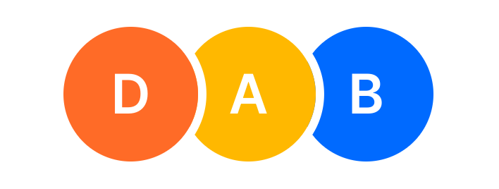

import { createSignal } from "solid-js";

export function getInitialsMagicNumberIncomplete(initials) {
  const numbers = initials
    .toLowerCase()
    .substring(0, 2)
    .split("")
    .map((char) => char.charCodeAt(0));
  return numbers.reduce((acc, n) => acc + n);
}

export function getInitialsMagicNumber(initials) {
  const numbers = initials
    .toLowerCase()
    .substring(0, 2)
    .split("")
    .map((char) => char.charCodeAt(0));
  const spice = numbers[0] < numbers[1] ? 0 : 1;
  return numbers.reduce((acc, n) => acc + n) + spice;
}

export const COLORS = ["purple", "orange", "green", "yellow", "blue"];
export const CLASS_BY_COLOR = {
  purple: "bg-purple-500",
  orange: "bg-orange-500",
  green: "bg-green-500",
  yellow: "bg-yellow-500",
  blue: "bg-blue-500",
  gray: "bg-gray-500",
};

export function getAvatarColorFromInitialsIncomplete(initials) {
  const magicNumber = getInitialsMagicNumberIncomplete(initials);
  const colorIndex = magicNumber % COLORS.length;
  return COLORS[colorIndex];
}

export function getAvatarColorFromInitials(initials) {
  const magicNumber = getInitialsMagicNumber(initials);
  const colorIndex = magicNumber % COLORS.length;
  return COLORS[colorIndex];
}

export function DemoInput(props) {
  return (
    <input
      value={props.value}
      aria-label="Initials"
      class="text-2xl w-24 h-12 border-2 border-accent rounded uppercase text-center focus:outline-none focus-visible:border-4 focus-scroll-target"
      type="text"
      maxlength={2}
      onInput={props.onInput}
    />
  );
}

export function MagicNumberDemoIncomplete() {
  const [initials, setInitials] = createSignal("DG");
  return (
    <div class="flex items-center justify-center gap-4">
      <DemoInput
        value="DG"
        onInput={(event) => {
          if (event.target.value) setInitials(event.target.value);
          else setInitials(undefined);
        }}
      />
      <div class="text-2xl">
        {initials() ? getInitialsMagicNumberIncomplete(initials()) : "-"}
      </div>
    </div>
  );
}

export function DemoAvatar(props) {
  return (
    <div
      class={`flex items-center justify-center font-bold text-2xl w-24 h-24 rounded-full text-white select-none uppercase ${
        CLASS_BY_COLOR[props.color]
      }`}
    >
      {props.initials}
    </div>
  );
}

export function InitialsColorDemoIncomplete() {
  const [initials, setInitials] = createSignal("DG");
  return (
    <div class="flex items-center justify-center gap-4">
      <DemoInput
        value="DG"
        onInput={(event) => {
          if (event.target.value) setInitials(event.target.value);
          else setInitials(undefined);
        }}
      />
      <DemoAvatar
        color={
          initials() ? getAvatarColorFromInitialsIncomplete(initials()) : "gray"
        }
        initials={initials() ?? "-"}
      />
    </div>
  );
}

export function invertInitials(initials) {
  return initials?.split("").reverse().join("");
}

export function DemoAvatarWithMagicNumber(props) {
  return (
    <div class="flex flex-col items-center justify-center gap-2">
      <DemoAvatar color={props.color} initials={props.initials ?? "-"} />
      <div class="text-2xl">{props.magicNumber ?? "-"}</div>
    </div>
  );
}

export function InitialsPermutationsDemo(props) {
  const [initials, setInitials] = createSignal("DG");
  const initialsColor = () =>
    initials() ? props.avatarColorFn(initials()) : "gray";
  const initialsColorInverted = () =>
    initials() ? props.avatarColorFn(invertInitials(initials())) : "gray";
  return (
    <div class="flex items-center justify-center gap-4">
      <DemoInput
        value="DG"
        onInput={(event) => {
          if (event.target.value) setInitials(event.target.value);
          else setInitials(undefined);
        }}
      />
      <DemoAvatarWithMagicNumber
        color={initialsColor()}
        initials={initials()}
        magicNumber={initials() ? props.magicNumberFn(initials()) : undefined}
      />
      <DemoAvatarWithMagicNumber
        color={initialsColorInverted()}
        initials={invertInitials(initials())}
        magicNumber={
          initials()
            ? props.magicNumberFn(invertInitials(initials()))
            : undefined
        }
      />
    </div>
  );
}

I've written about [tracking the loading state of an avatar image](../use-image-is-loaded) before. However, it's not uncommon to have users without a profile picture.

In that case, the usual approach is to show the user's initials over a colored background.



# Picking the right color

Avatars with images are **recognizable and memorable**. Just like you might recognize someone close to you by the sound they make when they walk, avatar images become a shortcut to quickly identify a user.

When there is no image to display, achieving the same result is a bit harder. A person's initials alone are not very useful when doing a quick visual scan. That's where the color comes in, and there are a few important rules to follow:

1. **Deterministic outcome:** it's not enough to just pick a random color, it needs to be consistent. If it was different every time, it'd be useless and confusing!
2. **Uniform probability distribution:** one color should not show up more often than the others.
3. **Disctinct permutations:** different arrangements of the same letters (like "DG" and "GD") should result in different colors. If not, it'd be hard to tell them apart since they share the same letters and colors!

With these in mind, we can now build the algorithm.

# The magic number

There are many possible combinations of initials.

We have 702 potential combinations with one or two initials ($26^1 + 26^2 = 702$), and that's just for the English alphabet (A-Z). It increases greatly when you account for other alphabets! Our mission is to turn each of these into a small number so that we can map it to a color.

For that, we can use a bit of simple [modular arithmetic](https://en.wikipedia.org/wiki/Modular_arithmetic), but we need to turn our initials into a number first. I call this number the "magic number" because I am fancy like that.

```ts twoslash
function getInitialsMagicNumber(initials: string) {
  const numbers = initials
    .toLowerCase()
    .substring(0, 2)
    .split("")
    .map((char) => char.charCodeAt(0));
  return numbers.reduce((acc, n) => acc + n);
}
```

To achieve this, we:

1. **"Normalize"** the initials string by converting it to lowercase and taking only the first two characters.
2. Split and turn both characters into **numbers** with [String.prototype.charCodeAt](https://developer.mozilla.org/en-US/docs/Web/JavaScript/Reference/Global_Objects/String/charCodeAt).
3. Finally, **add** them together to get the magic number.

Here's a little playground to try it out:

<MagicNumberDemoIncomplete />

# Mapping to a color

Let's say we have these five colors:

```ts twoslash
const COLORS = ["purple", "orange", "green", "yellow", "blue"] as const;
```

We can now map the magic number to one of these colors by using the [remainder (%) operator](https://developer.mozilla.org/en-US/docs/Web/JavaScript/Reference/Operators/Remainder) (A.K.A. modulo).

```ts twoslash
const COLORS = ["purple", "orange", "green", "yellow", "blue"] as const;
declare function getInitialsMagicNumber(initials: string): number;
// ---cut---
export function getAvatarColorFromInitials(initials: string) {
  const magicNumber = getInitialsMagicNumber(initials);
  const colorIndex = magicNumber % COLORS.length;
  return COLORS[colorIndex];
}
```

Try it:

<InitialsColorDemoIncomplete />

With this, we achieved our first two goals: deterministic outcome and (more or less) uniform probability distribution. We're missing the third one, though.

# Disctinct permutations

Here's a demo that shows the color for both permutations of the same initials (the numbers below are the magic numbers):

<InitialsPermutationsDemo
  avatarColorFn={getAvatarColorFromInitialsIncomplete}
  magicNumberFn={getInitialsMagicNumberIncomplete}
/>

As you can see, with the current algorithm, the colors are the same for both permutations. This is because the magic number is the same for both.

We can fix that with a little trick: we can add something I called "spice" (because, again, _I am fancy like that_) to the magic number. This spice will be a number that is either 0 or 1, depending on the order of the characters (based on their UTF-16 code unit).

For example, if we have "DG" and "GD", only one of them will be affected by the spice, so they will have different magic numbers and, therefore, different colors.

```ts twoslash {7-8}
function getInitialsMagicNumber(initials: string) {
  const numbers = initials
    .toLowerCase()
    .substring(0, 2)
    .split("")
    .map((char) => char.charCodeAt(0));
  const spice = numbers[0] < numbers[1] ? 0 : 1;
  return numbers.reduce((acc, n) => acc + n) + spice;
}
```

Now it works as intended:

<InitialsPermutationsDemo
  avatarColorFn={getAvatarColorFromInitials}
  magicNumberFn={getInitialsMagicNumber}
/>

And we are done!

# Bonus: initials from name and one final demo

Here's another neat utility to extract initials (up to two characters) from a name:

```ts twoslash
export function getInitialsFromName(name: string) {
  const matchResult = name?.matchAll(/(\S)\S*/g);
  const matches = [...matchResult].map((r) => r[1]);
  return matches ? `${matches[0]}${matches[1] ?? ""}` : undefined;
}
```

Finally, [here's a demo](https://atlas.guide.co/?path=/story/components-avatar--colors) of the `Avatar` component I built for [Guide](https://guide.co) that displays all permutations of initials using a-z and a few non-English characters:


