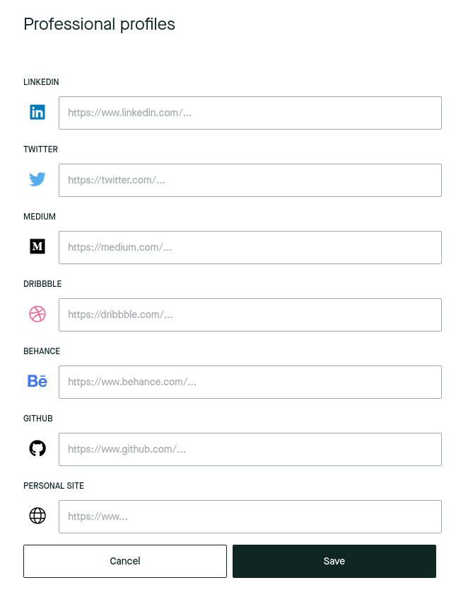
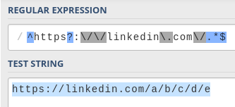
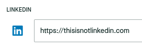
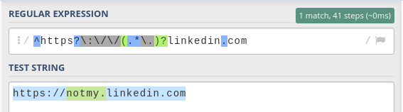
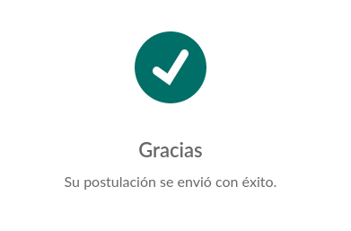

> **Too long, didn't read?**
>
> This article describes a series of vulnerabilities and exploits that I found to circumvent regex URL validation.
>
> Jump straight to the exploits:
>
> - [#1 - The optional dot exploit](#1---the-optional-dot-exploit)
> - [#2 - The escaping exploit](#2---the-escaping-exploit)
> - [#3 - The subdomain exploit](#3---the-subdomain-exploit)
>
> You will probably need to scroll up a bit to get more context on the vulnerabilities that make these exploits possible.
>
> Also check out how to protect a RegExp against them:
>
> - [Securing the RegExp](#securing-the-regexp)

# LinkedIn... meh

For those who know me, this is no secret: I'm not very _fond_ of LinkedIn.

The main thing that keeps me away from it is its culture. I don't want to generalize though, I'm sure most of the people in there are wonderful and find value in it... It's just not my cup of tea.

<YoutubeVideo id="37IC0NOBoeg" />

I get it, though. _Everyone's on there, so you might as well be on it too._ It's a de-facto standard at this point, and generally a must for anyone looking for a job or industry connections.

# No LinkedIn? No job!

At some point in the past, I ended up completely deleting my LinkedIn profile. It was severely outdated anyway, and my official title on it at that point was _"Senior Lemon Eater"_, which I had copied from someone else.

Whenever I wanted to look for a job, my strategy didn't involve LinkedIn at all. I just relied on the good ol' _résumé_, a simple PDF file with all relevant stuff about me on it. Sometimes not even that.

This worked great for the most part... until I tried to create a profile on a recruiting platform.

The process involved filling up your profile data, including your social profiles, website, etc. One of these fields was for a LinkedIn profile which I left empty. Then I tried to link to my CV and, well, there was no place in which I could submit it!

This was a problem.



It turns out that recruiters on this platform rely exclusively on LinkedIn profiles to find out basic career information about potential candidates. But I had no LinkedIn profile, nor any intention to create one. I had already occupied the "personal site" slot with my, you know, _personal site_.

I tried to just put a link to my CV on the LinkedIn field, but no dice. It was failing validation (note the red outline).


# No LinkedIn? No problem!

The validation was happening server-side, so I didn't have access to the validation code, but I knew it was most likely a RegExp pattern.

> **"RegExp" and "regex"** are abbreviations for ["regular expression"](https://en.wikipedia.org/wiki/Regular_expression), which is a way of defining **search patterns for strings**. In this case, it is being used to "search" for a LinkedIn URL. If the search is not successful, then the value is deemed invalid.
>
> This is a widely used validation technique for text-based input.

Knowing this, and filled with determination to avoid LinkedIn at all costs, I set myself the challenge of bypassing this validation somehow.


I started by trying to break it with non-LinkedIn URLs, like:

- `https://someurl.com#linkedin.com/`
- `https://someurl.com?.linkedin.com/`
- `https://linkedin.com.someurl.com/`

These are attempts at fooling the validation by creating a LinkedIn-like URL that actually points to the `someurl.com` domain.

In the first two, I was trying to use "escaping" characters such as `?` (used for query parameters) and `#` (used for anchor links). In the last one, I was trying to use a subdomain, hoping that the final `/` character was not being matched.

However, none of these worked.

## Replicating the RegExp

My next step was to come up with my own regular expression to try and recreate theirs. I headed to [regex101](https://regex101.com/), my favorite RegExp tool, and wrote a simple LinkedIn URL pattern:



```
^https?:\/\/linkedin\.com\/.*$
```

\> [open in regex101](https://regex101.com/r/eWLDTa)

This pattern allows for any kind of subpath of LinkedIn URLs. It seems pretty much impossible to exploit. The pattern forces the string to start with `https://linkedin.com/` (or `http`, the `s` is optional) literally, with no other option.

However, while I was testing some values on the original page, I noticed that it also allowed subdomains such as `example.linkedin.com` or even `example.sub-domain.linkedin.com`.

I modified my RegExp pattern to reflect this:


```
^https?:\/\/[-a-z0-9.]*linkedin\.com\/.*$
```

\> [open in regex101](https://regex101.com/r/tqsax5)

The addition is `[-a-z0-9.]*`, which matches subdomains:

- `[<characters>]` means "match any of these characters".
  - `-`, `a-z` and `0-9` match hyphens, letters, and numbers, which are the allowed characters for a subdomain.
  - `.` matches the dot character, which is the separator for the sub-domain segments.
- `*` means "match between 0 and infinite times".

This makes things more interesting. I started playing with it and quickly found a vulnerability.

## The dot

The `.` character is a must if you want to match a subdomain. If you wanted to make the expression more constrained, you could try supporting just a single segment (i.e. `subdomain.example.com`, **not** `sub.dom.ain.example.com`), like this (shortened for brevity):

```
[-a-z0-9]*\.linkedin\.com
```

\> [open in regex101](https://regex101.com/r/OXkYo8)

In this case, the `.` character is being matched literally (`\.`) along with the rest of the `linkedin.com` domain. Because the "escaping" characters mentioned above (`#`, `?`, etc) are not included in the subdomain part of the expression (`[-a-z0-9]`), there is no room for any exploits of that nature.

Of course, this RegExp would **only** allow URLs **with** a subdomain (e.g. `linkedin.com` wouldn't be allowed), so it doesn't work for us anyway.

You could then make the dot optional with something like `\.?`, but then you are losing the guarantee that it'll be matched exactly at that position (right before the `linkedin.com` part), which was the point in the first place.

So you might as well just include the dot inside the square brackets and match it along with the rest of the characters (`[-a-z0-9]*\.?` -> `[-a-z0-9.]*`).

This also allows for multiple-segment subdomains (`first.second.third.example.com`).

A two for one. That's a win! _Right?_

Well, **no**.

# #1 - The optional dot exploit

Because you are **not** matching the dot character **exactly before the domain** anymore, it could be there... or not.

You can have any arbitrary string of characters in any order before `linkedin.com` and, as long as they are included inside the square brackets, there will be a match.

You also don't need to have a dot character in there at all. The characters between the square brackets act as sort of a whitelist, which means they are the _allowed_ characters, not _required_.

That means that a URL such as `https://asdflinkedin.com/` is successfully matched.


I had found a vulnerability on my own RegExp!

Of course, there was no guarantee that the actual validation RegExp is similar to mine, but I had to try...



I clicked "save" and...


Nice! It works!

## The payload

With this exploit, I had a way to set a non-LinkedIn URL. The domain, however, had to end with `linkedin.com`. I was hosting my CV on Google Drive, which meant that the URL looked like this: `https://docs.google.com/document/...`.

How could I link this document, then?

Easy. I bought the [`notmylinkedin.com`](https://notmylinkedin.com/) domain, configured it to redirect to my CV, and submitted it on the recruitment platform. Done!

Now every time a recruiter wanted to see my "LinkedIn", they were gracefully redirected to my CV. This was also fun because Google Docs showed me how many people were reading the document in real-time, and I could see the recruiters come and go.

# No LinkedIn? No problem! (act II)

A short while after the first hack, still on my job hunt, I was presented with an application form that was forcing me to submit a LinkedIn profile. Of course, I tried to submit my domain, `notmylinkedin.com`.


However, it was not letting me. This is the error message I got:


Oh, look at that! The regular expression used to validate the field is right there in the message. Convenient, lol.

Let's play with it in regex101.


```
^https?:\/\/(.*\.)?linkedin\.com
```

\> [open in regex101](https://regex101.com/r/brNYfG)

This expression prevents the dot vulnerability that the previous one had. To match potential subdomains, it uses the following expression:

```
(.\*\.)?
```

- `(<expression>)?` is an optional capture group, which means that it can either completely match the expression inside, or nothing at all.
- `.*` means "match any character, from 0 to infinite times"
- `\.` means "match the dot character"

This pattern matches text with the shape `<anything>.` (e.g. `subdomain.`). This way, it makes sure that, if there is any kind of match before `linkedin.com`, it ends with a dot. This explicitly separates the subdomain from the domain name, effectively preventing the previous hack, while still making subdomains optional.



However, because it uses `.*`, it is matching **any** character. The previous one was limited to letters (`a-z`), numbers (`0-9`), hyphens (`-`) and dots (`.`), but this one is not.

> **Note:** a dot inside square brackets (`[.]`) matches the dot character, while when used elsewhere in the regular expression it matches any character.

# #2 - The escaping exploit

If we can use any character, then maybe we can use one of the "escaping" characters that I had initially attempted to use...


Bingo! Using the `?` character works with this pattern. This is what the address looks like if you enter it in a browser:


Notice how the browser highlights the domain that the URL is pointing to: `notmylinkedin.com`

This trick works because these characters divide URLs into different fragments that serve different purposes. Here are a few examples:

- The `?` character separates the **query parameters**:

  Example URL: `https://example.com?key=value`

  The query parameters are `key=value`

- The `#` character separates the **[anchor ID](https://html.com/anchors-links/)**:

  Example URL: `https://example.com#section`

  The anchor ID is `section`

- The `/` character separates the **pathname**:

  Example URL: `https://example.com/path`

  The pathname is `path`

Only one thing left to do. I submitted it... and it worked!



The payload, as you can see, is the same as the one I used with the first exploit. Any query parameters, anchor ID or pathname would still redirect to my CV, so it works just fine.

# #3 - The subdomain exploit

When I further analyzed this regular expression, I realized that there was yet another vulnerability.

Let's look at the expression again:

```

^https?:\/\/(.\*\.)?linkedin\.com

```

Notice how there's nothing after `.com`. This allows us to write anything we want after it.

For instance, we could input `https://linkedin.com.example.com` and it'd still match.


We could use the same payload again by entering `https://linkedin.com.notmylinkedin.com` and it would work as long as I redirect all subdomains to my CV as well.

I didn't get to try this exploit, but I'm pretty sure it'd have worked.

# Securing the RegExp

The first validation was protected against arbitrary characters in the subdomain but didn't handle the dot correctly.

The second validation handled the dot correctly but allowed arbitrary characters in the subdomain. Not only that, but it was also vulnerable to the subdomain exploit as well.

To be honest, I find that hilarious. It's also pretty harmless in this case, as the potential for doing evil stuff is quite limited. However, under different circumstances, it could be a very serious security problem.

So, how do you protect against all these exploits?

We've already seen separate techniques for the first two:

- Matching the dot literally before the domain (prevents the dot exploit, #1)

  ```
  (\.)?linkedin\.com
  ```

- Matching only allowed subdomain characters (prevents the escaping exploit, #2)

  ```
  [-a-z0-9.]
  ```

We can just combine them:

```
([-a-z0-9.]*\.)?linkedin\.com
```

Additionally, we can add the `/` character at the end to prevent exploit #3 (the subdomain exploit) as well. We could also put this inside of an optional capturing group in case we wanted to allow something like `https://linkedin.com` (without the final `/`), although that's more of an edge-case.

The full expression looks like this:

```
^https?:\/\/([-a-z0-9.]*\.)?linkedin\.com\/.*$
```

\> [open in regex101](https://regex101.com/r/seF1hg)

Let's put it to the test:


Success!

---

I'm not 100% sure that this RegExp is not vulnerable, but at least it is protected against these three attacks.

If you still manage to break it somehow, please [let me know](https://twitter.com/daniguardio_la)!

In conclusion, remember to secure your regular expressions if you don't want someone like me getting past them 😇.

(also please just **PLEASE** don't force me to create a LinkedIn profile)
