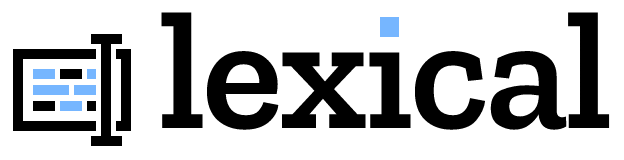

import { LexicalExplainedIndex } from "~/components/LexicalExplainedIndex";

<LexicalExplainedIndex />

Welcome to the "Lexical, explained" series!

In this series, we'll demystify Lexical and explore its clever design. Plus, I'll share personal insights and opinions along the way.

[Lexical](https://lexical.dev/) is a game-changing web text editor framework built at Meta, used by "hundreds of millions of users across Facebook, Workplace, Messenger, WhatsApp, and Instagram".

At [Guide](https://guide.co/), we've built a text editor using Lexical and found it to be an excellent choice for the job.

Our editor features rich text, interactive blocks, variables/tokens, mentions, floating and fixed toolbars, a command/typeahead menu, Markdown-like shortcuts, and more.

TODO: add demo video

I'm excited to share some of the lessons I've learned in this series. I assume some level of familiarity with the basics, so go read the [official documentation](https://lexical.dev/docs/intro) if you haven't done it yet.

# Lexical in a nutshell

Before we get started, let's cover some fundamental facts about Lexical:

- It is **framework-agnostic**, meaning that it can be used with any view framework (or without one!). Only React is officially supported, but there are community efforts to support others, like [Solid](https://github.com/mosheduminer/lexical-solid).
- It uses **[`contenteditable`](https://developer.mozilla.org/en-US/docs/Web/HTML/Global_attributes/contenteditable)** under the hood, an attribute that makes HTML elements editable.
- It is powered by a **DOM reconciler**, which compares the current and next editor states and applies any necessary changes to the DOM. It resembles a "virtual DOM" (like React's), optimized for text editing.

The name "Lexical" was chosen because it relates to language and words, but also because it cleverly utilizes JavaScript's lexical scoping as part of its design. If you're interested in learning more about this, keep an eye out for the upcoming article on state updates.

# Lexical, explained

I'd like to be explicit about the goals and non-goals of this series so you know what to expect.

## Goals

- Cover interesting topics.
- Share personal learnings and opinions.
- Deconstruct some of the architecture and design decisions.
- Keep it open-ended, with the possibility of adding new articles anytime.
- Go beyond Lexical itself, and explore how to build on top of it.

## Non-goals

- Be exhaustive.
- Replace the official documentation.
- Hold the reader's hand.
- Provide support to Lexical users.
- Be always up to date.

## Before you read on

As we cover a range of topics, I'll publish the articles in a logical order so that you can follow along and build a mental model of how Lexical works. However, to make the most of the series, I encourage you to switch between articles and the Lexical documentation as needed to understand the full picture.

Please note that since Lexical is an actively developed project with an unstable API, some information in these articles may become outdated. If you notice anything that's no longer accurate, please inform me, and I'll be glad to update the article or add a note at the top.

Thanks for joining me on this journey, and I hope you enjoy the series!
