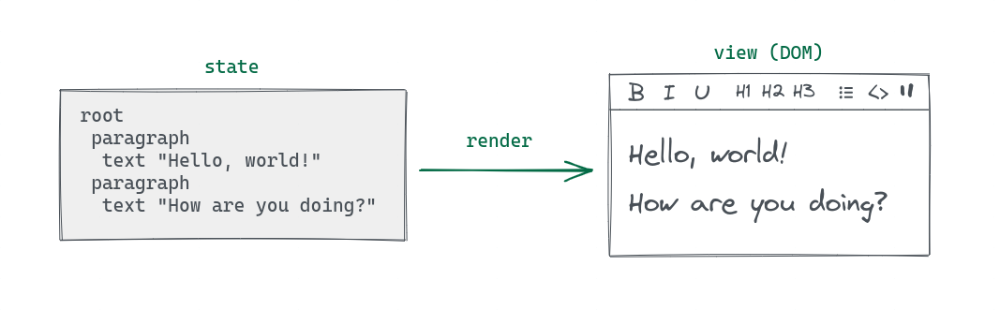
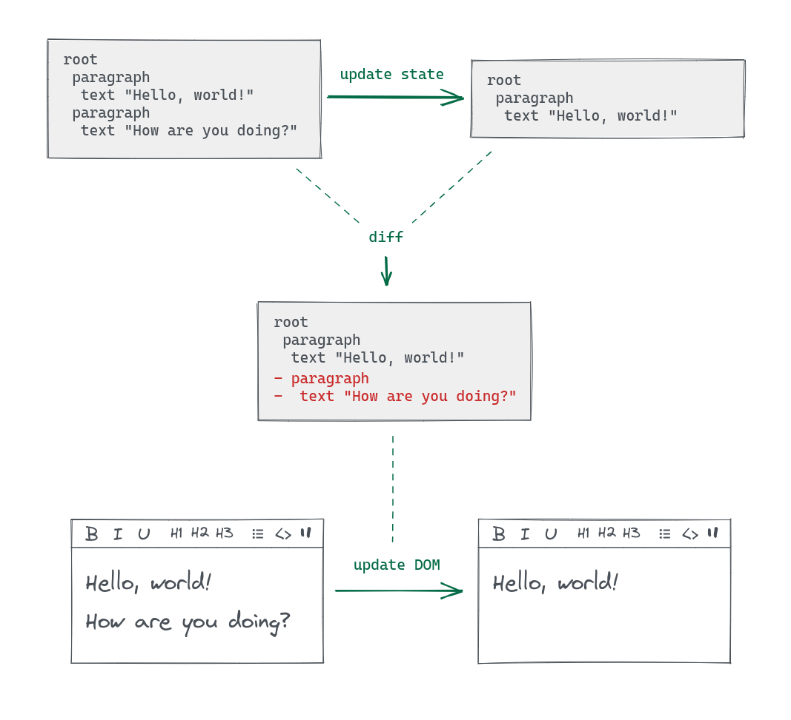

[Lexical](https://lexical.dev/) is a popular JavaScript text editor framework.

State updates are one of its core concepts, and Lexical has a very unique take on them. This article will demystify how they work.

If you are a Lexical user, you will walk away with a deeper understanding of it that'll help you build better text editors. And if you aren't, you will still add a clever JavaScript technique to your toolbelt.

# What is an update?

A Lexical state (`EditorState`) holds two important pieces of data: the current **node tree** and the **selection state**. An editor instance (`LexicalEditor`) always contains a state (the "active" state).

The state (not the DOM) is the source of truth for the editor. The DOM is always **computed** from the state and never the other way around. A fancier way to put it is:

> The view (DOM) is a function of the state (`EditorState`).



When the state is updated, Lexical computes the differences between the previous and next states and then applies them to the DOM in a process called "reconciliation".



In this simplified example, the previous state had two paragraphs, while the next one only has one. After comparing them, Lexical knows that the second paragraph needs to be removed, so it removes it from the DOM.

This resembles the concept of "virtual DOM diffing" from other projects like React, although in practice there are many differences.

---

Lexical triggers updates internally in multiple situations. Some examples:

- In response to events, like [when the user types text into the editor](https://github.com/facebook/lexical/blob/12a045e533b19e058d98e609873832cea2e3ac85/packages/lexical/src/LexicalEvents.ts#L600).
- When `LexicalEditor.focus` is called, [in order to set the right selection state](https://github.com/facebook/lexical/blob/12a045e533b19e058d98e609873832cea2e3ac85/packages/lexical/src/LexicalEditor.ts#L818).
- In some of the internal logic, [like the `markAllNodesAsDirty` util](https://github.com/facebook/lexical/blob/12a045e533b19e058d98e609873832cea2e3ac85/packages/lexical/src/LexicalUtils.ts#L388).

# `LexicalEditor.update()`

It is also possible to update the state manually, by executing the `LexicalEditor.update` method with a callback (the "update function"). Here's an example from the docs:

```ts twoslash
import {
  createEditor,
  $getRoot,
  $getSelection,
  $createParagraphNode,
  $createTextNode,
} from "lexical";
const config = {
  namespace: "MyEditor",
  theme: {},
  onError: console.error,
};
const editor = createEditor(config);
// ---cut---
editor.update(() => {
  // Get the RootNode from the EditorState.
  const root = $getRoot();

  // Create a new ParagraphNode.
  const paragraphNode = $createParagraphNode();

  // Create a new TextNode.
  const textNode = $createTextNode("Hello world");

  // Append the text node to the paragraph.
  paragraphNode.append(textNode);

  // Finally, append the paragraph to the root.
  root.append(paragraphNode);
});
```

This is one of the most important features in Lexical: the ability to **programatically update the state**.

For example, if you want to build an "insert" button to add a node like "image" or "video", you need to update the state\*.

> \* Realistically, this would probably be implemented by dispatching an "insert" command, but even in that case, the command listener will update the state.

---

The code example above prompts a few questions:

> - We're not returning anything, nor calling any sort of `setState` function.
>
>   **How is the resulting state persisted?**
>
> - We might have different editor instances on our app loaded at the same time.
>
>   **How does `$getRoot()` know which editor to get the root node from?**
>
> - _...is this PHP? jQuery?!?_
>
>   **What are these `$` methods?**

We'll get to the answers soon (spoiler: _they're all related to lexical scope_), but we need to lay the groundwork first.

# The update lifecycle

It's sometimes easier to think of state as something that is "updated" or "changed". Conceptually, that's what happens.

In reality, the state of an editor instance is not _updated_: it's _replaced_ with a new state. Editor states are immutable by default and cannot be altered directly.

---

These are roughly the steps that happen when an update happens:

export const CurrentState = () => (
  <span class="text-green-700 font-bold">current state</span>
);

export const PendingState = () => (
  <span class="text-orange-700 font-bold">pending state</span>
);

export const UpdateFunction = () => (
  <span class="text-blue-700 font-bold">update function</span>
);

export const mutable = <span class="text-green-500 font-bold">✔</span>;

export const lock = "🔒";

- The {<CurrentState />} is **cloned**. This cloned state becomes the "{<PendingState />}".
- The {<PendingState />} becomes {mutable} **mutable**.
- The {<UpdateFunction />} applies **changes** to the {<PendingState />}.
- Once the {<UpdateFunction />} is done, the {<PendingState />} is {lock} **locked** (made immutable).
- Reconciliation happens and the resulting changes are applied to the DOM.
- The {<PendingState />} is set as the {<CurrentState />}, effectively replacing it.

---

While this doesn't answer our questions yet, it offers a hint: the pending state is mutable while the update function is running.

We now know that it is possible to mutate the pending state, but we still don't know _how_.

# Anatomy of an update

To get a clearer picture of what's going on, let's create a simplified version of [the method that executes an update](https://github.com/facebook/lexical/blob/12a045e533b19e058d98e609873832cea2e3ac85/packages/lexical/src/LexicalUpdates.ts#L882) in Lexical. `LexicalEditor.update()` calls this method internally.

Here's a skeleton implementation:

```ts twoslash
import type { LexicalEditor } from "lexical";
import { cloneEditorState } from "lexical/LexicalEditorState";

let isReadOnlyMode = true;
declare function commitPendingUpdates(editor: LexicalEditor): void;
// ---cut---
function updateEditor(editor: LexicalEditor, updateFn: () => void) {
  // Get the current state.
  const currentEditorState = editor._editorState;
  //    ^?

  // Clone the current state and set it as the pending state.
  editor._pendingEditorState = cloneEditorState(currentEditorState);

  // Enable mutability.
  isReadOnlyMode = false;

  // Execute the update function.
  updateFn();

  // Disable mutability.
  isReadOnlyMode = true;

  // Commit pending updates.
  commitPendingUpdates(editor);
}
```

There are two distinct phases:

1. **Update phase:** the state is cloned and the update function is executed.
2. **Commit phase:** reconciliation happens, and the new state replaces the old one.

> **Reconciliation** is the process of comparing the pending and current states, and applying any necessary changes to the DOM.

The second phase happens entirely inside of `commitPendingUpdates`. Here's an extremely simplified representation of what it does:

```ts twoslash
import type { LexicalEditor, EditorState } from "lexical";
declare function reconcileDOM(
  currentState: EditorState,
  pendingState: EditorState
): void;
// ---cut---
function commitPendingUpdates(editor: LexicalEditor) {
  // Get the current state.
  const currentState = editor._editorState;

  // Get the pending state.
  const pendingState = editor._pendingEditorState!;

  // Reconcile the DOM.
  reconcileDOM(currentState, pendingState);

  // Set the pending state as the current state.
  editor._editorState = pendingState;
}
```

# The lexical scope

Something that stands out here is `isReadOnlyMode`. Where is it coming from?

Simple: it's defined at the module level. The `LexicalUpdates.ts` module contains both the `isReadOnlyMode` variable declaration and the `updateEditor` function:

```ts twoslash {1, 5, 7}
import type { LexicalEditor } from "lexical";
// ---cut---
let isReadOnlyMode = true;

export function updateEditor(editor: LexicalEditor, updateFn: () => void) {
  // ...
  isReadOnlyMode = false;
  // ...
  isReadOnlyMode = true;
}
```

This is useful due to **lexical scope**.

> **Fun fact!**
>
> Lexical used to be called "Outline", but at some point, it was renamed to "Lexical", which is a reference to JavaScript lexical scope.
>
> As Dominic Gannaway (the brain behind this approach!) told me:
>
> "This is exactly why we called the project Lexical. It has double meaning. Lexical's main workflow is via lexical scopes, but Lexical also has meanings around language and words."
>
> If you're unfamiliar with this concept, you should [learn about it](https://developer.mozilla.org/en-US/docs/Glossary/Scope) before you read on.

Specifically, Lexical is taking advantage of _module scope_, which is the scope at which the variable is being declared. This means that we have access to the variable from anywhere in the module.

Here's something interesting though. If you've used Lexical before, you might have run into this error while trying to call a method like `node.insertAfter()` **outside** of an `LexicalEditor.update()` callback:

```ts twoslash
import type { NodeKey } from "lexical";
import { createEditor, $getNodeByKey, $createParagraphNode } from "lexical";

const config = {
  namespace: "MyEditor",
  theme: {},
  onError: console.error,
};
const editor = createEditor(config);
declare const key: NodeKey;
const node = $getNodeByKey(key)!;
const paragraph = $createParagraphNode();
// ---cut---
// this is fine
editor.update(() => {
  node.insertAfter(paragraph);
});

// this fails
node.insertAfter(paragraph);
// error: "Cannot use method in read-only mode"
```

How does `insertAfter` know about the read-only mode state? `insertAfter` is not declared in the same file as `isReadOnlyMode`, so what's going on?

We're getting very close to the answers now.

## Updates run synchronously

Take another look at `updateEditor`. It is synchronous, which means that we can be confident about the order of operations. Let me illustrate this:

```ts twoslash
import type { LexicalEditor } from "lexical";
// ---cut---
let isReadOnlyMode = true;

export function updateEditor(editor: LexicalEditor, updateFn: () => void) {
  console.log(isReadOnlyMode); // > true

  isReadOnlyMode = false;
  console.log(isReadOnlyMode); // > false

  isReadOnlyMode = true;
  console.log(isReadOnlyMode); // > true
}
```

This is fairly simple, but important! The key takeaway here is that, by the time our update callback is called, `isReadOnlyMode` will be `false`, effectively signaling that the pending state is mutable at that time:

```ts twoslash {4-5}
import type { LexicalEditor } from "lexical";
// ---cut---
let isReadOnlyMode = true;

export function updateEditor(editor: LexicalEditor, updateFn: () => void) {
  isReadOnlyMode = false;
  updateFn(); // While this function runs, isReadOnlyMode is false.
  isReadOnlyMode = true;
}
```

## Module scope can be accessed externally

Modules can expose values in their scope to the outside world through `export` statements. That's the point of modules after all!

```twoslash include module-one
// @module: esnext
// @filename: module-one.ts
const privateConst = "my constant";
let privateLet = "my variable";

function privateFunction() {
  // ...
}

export const publicConst = "my public constant";
export let publicLet = "my public variable";
export function publicFunction() {
  // ...
}
```

```ts twoslash
// @include: module-one
```

We can import **public** modules like this:

```ts twoslash
// @include: module-one
// ---cut---
// @filename: module-two.ts
import { publicConst, publicLet, publicFunction } from "./module-one";
```

Values that are not exported cannot be imported from other modules (they are **"private"**).

```ts twoslash
// @errors: 2459
// @include: module-one
// ---cut---
// @filename: module-two.ts
import { privateConst, privateLet, privateFunction } from "./module-one";
```

---

Let's look at the `isReadOnlyMode` variable again. It's not exported, we cannot use it directly from other modules:

```ts twoslash {2, 7, 10-12}
// @errors: 2459
// @filename: LexicalUpdates.ts
let isReadOnlyMode = true; // no "export" keyword!

export function updateEditor() {}

// @filename: a-module-somewhere.ts
import { isReadOnlyMode } from "./LexicalUpdates";

function $mutateStateSomehow() {
  if (isReadOnlyMode) {
    throw new Error("Cannot use method in read-only mode");
  }
}
```

However, we can still create a function in our module that returns it. That's exactly what Lexical does:

```ts twoslash {4-6, 9, 12-14}
// @filename: LexicalUpdates.ts
let isReadOnlyMode = true;

export function isCurrentlyReadOnlyMode(): boolean {
  return isReadOnlyMode;
}

// @filename: a-module-somewhere.ts
import { isCurrentlyReadOnlyMode } from "./LexicalUpdates";

function $mutateStateSomehow() {
  if (isCurrentlyReadOnlyMode()) {
    throw new Error("Cannot use method in read-only mode");
  }
}
```

Lexical goes a step further by directly exporting a function that performs this check and throws the error for us:

```ts twoslash {4-8, 11, 14}
// @noErrors
// @filename: LexicalUpdates.ts
let isReadOnlyMode = true;

export function errorOnReadOnly(): void {
  if (isReadOnlyMode) {
    throw new Error("Cannot use method in read-only mode.");
  }
}

// @filename: a-module-somewhere.ts
import { errorOnReadOnly } from "./LexicalUpdates";

function $mutateStateSomehow() {
  errorOnReadOnly();
}
```

## Module scope + synchronous execution = win

It's time to connect the dots!

In the previous section, we created `$mutateStateSomehow`. When this function is called, it checks the value of `isReadOnlyMode` from the `LexicalUpdates.ts` module.

This function is intended to be called inside of `updateEditor` (normally through `LexicalEditor.update()`), like this:

```ts twoslash
import {
  createEditor,
  $getRoot,
  $getSelection,
  $createParagraphNode,
  $createTextNode,
} from "lexical";
const config = {
  namespace: "MyEditor",
  theme: {},
  onError: console.error,
};
const editor = createEditor(config);
function $mutateStateSomehow() {}
// ---cut---
editor.update(() => {
  $mutateStateSomehow();
});
```

Remember, our update callback is executed synchronously, and right before `isReadOnlyMode`:

```ts twoslash {4-5}
import type { LexicalEditor } from "lexical";
// ---cut---
let isReadOnlyMode = true;

export function updateEditor(editor: LexicalEditor, updateFn: () => void) {
  isReadOnlyMode = false;
  updateFn(); // $mutateStateSomehow is executed at this point.
  isReadOnlyMode = true;
}
```

This means that, when `$mutateStateSomehow` is called, `isReadOnlyMode` will be `false`, and the error will not be thrown.

---

Now you should be able to see how Lexical cleverly takes advantage of these behaviors (synchronous execution and module scope).

It uses them to create a "global state" of sorts. In this case, to track whether the editor is in read-only mode at some point in time. Functions that wish to mutate the state can perform this check through this technique.

We can answer the last question now:

> **What are these `$` methods?**
>
> The `$` prefix is a convention used with Lexical to denote functions that depend on the `LexicalUpdate.ts` lexical scope and, therefore, can only be called inside of the `LexicalEditor.update()` (or `EditorState.read()`!) callback.

There are many `$` functions in the Lexical packages. For example, here are the ones exported by the `lexical` package itself:

```ts twoslash
// @noErrors
import { $ } from "lexical";
//        ^|
```

<div class="h-36" />

When building something with Lexical, it's also useful to use this convention for your own functions. A good rule of thumb is that, if your function is calling a `$` function, it should also be prefixed with `$`.

## Active editor and state

Lexical uses the same technique to track which **editors** and **editor states** are currently "active" (which means they are the target of the current operation).

```ts twoslash {2-3, 9, 20, 34-35, 42-43}
import type { EditorState, LexicalEditor } from "lexical";
import { cloneEditorState } from "lexical/LexicalEditorState";
declare function commitPendingUpdates(editor: LexicalEditor): void;
// ---cut---
let isReadOnlyMode = true;
let activeEditorState: null | EditorState = null;
let activeEditor: null | LexicalEditor = null;

export function isCurrentlyReadOnlyMode(): boolean {
  return isReadOnlyMode;
}

export function getActiveEditorState(): EditorState {
  if (activeEditorState === null) {
    throw new Error(
      "Can only be used in the callback of" +
        "editor.update() or editorState.read()"
    );
  }

  return activeEditorState;
}

export function getActiveEditor(): LexicalEditor {
  if (activeEditor === null) {
    throw new Error("Can only be used in the callback of editor.update()");
  }

  return activeEditor;
}

export function updateEditor(editor: LexicalEditor, updateFn: () => void) {
  const currentEditorState = editor._editorState;
  editor._pendingEditorState = cloneEditorState(currentEditorState);

  // Set lexically scoped variables.
  isReadOnlyMode = false;
  activeEditor = editor;
  activeEditorState = editor._pendingEditorState;

  // Execute the update callback.
  updateFn();

  // Reset lexically scoped variables.
  isReadOnlyMode = true;
  activeEditor = null;
  activeEditorState = null;

  // Commit pending updates.
  commitPendingUpdates(editor);
}
```

Which gives the answers to the remaining questions:

> **How is the resulting state persisted?**
>
> The pending state is stored in `activeEditorState`. This state will be mutable during the `LexicalEditor.update()` callback, so it can be modified by it. Later, `commitPendingUpdates` will take care of replacing the current state with the pending one, effectively "persisting" it.

> **How does `$getRoot()` know which editor to get the root node from?**
>
> The editor instance is stored in `activeEditor` when `LexicalEditor.update()` is called. This allows functions like `$getRoot()` to access it (through `getActiveEditor()`).

# `EditorState.read()`

Sometimes you just want to read a state, without mutating it.

Since we still depend on the module scope, we need a [`readEditorState` function](https://github.com/facebook/lexical/blob/a0d5e95ec0371dae915b5c000e2bc68f029644d3/packages/lexical/src/LexicalUpdates.ts#L391-L410) that sets up the lexical scope for us, similar to `updateEditor`. It looks like this:

```ts twoslash
import type { LexicalEditor, EditorState } from "lexical";

let isReadOnlyMode = true;
let activeEditorState: null | EditorState = null;
let activeEditor: null | LexicalEditor = null;
// ---cut---
export function readEditorState<V>(
  editorState: EditorState,
  callbackFn: () => V
): V {
  const previousActiveEditorState = activeEditorState;
  const previousReadOnlyMode = isReadOnlyMode;
  const previousActiveEditor = activeEditor;

  activeEditorState = editorState;
  isReadOnlyMode = true;
  activeEditor = null;

  const result = callbackFn();

  activeEditorState = previousActiveEditorState;
  isReadOnlyMode = previousReadOnlyMode;
  activeEditor = previousActiveEditor;

  return result;
}
```

# Commit scheduling and batching

The commit phase of an update (`commitPendingUpdates`) is [scheduled in a microtask](https://github.com/facebook/lexical/blob/a0d5e95ec0371dae915b5c000e2bc68f029644d3/packages/lexical/src/LexicalUpdates.ts#L950) by default, meaning that it will only happen after all other synchronous code has finished executing.

If you execute multiple updates synchronously in a row, the resulting state will only be committed once (at the end of the current tick).

This also happens with nested updates, which are updates that have been created during the execution of another update, or in other words, a `LexicalEditor.update()` call from the callback of another `LexicalEditor.update()` call.

Here's an example:

```ts twoslash
import { createEditor } from "lexical";
const config = {
  namespace: "MyEditor",
  theme: {},
  onError: console.error,
};
const editor = createEditor(config);
// ---cut---
editor.update(() => {}); // A
// > update A is executed

editor.update(() => {}); // B
// > update B is executed

editor.update(() => {}); // C
// > update C is executed

// (any other synchronous code is executed...)

// --- synchronous code finishes executing ---

// > updates A, B and C are committed
```

This is possible due to the architecture of updates that we've learned about in the previous sections.

When multiple updates happen synchronously, they will all be updating the same pending state in a chain. Conceptually, the output of the first update will be the input of the second update, and so on.

Only once all updates are done, the pending state will be committed, and the editor state will be replaced with it. This is an important performance optimization since reconciliation can be an expensive process.

## Discrete updates

While commit scheduling and batching are normally what we want, they can sometimes get in the way.

Consider this example: you're trying to manipulate an editor state in a server context and then persist it in a database.

```ts twoslash
import { createEditor, SerializedEditorState } from "lexical";
const config = {
  namespace: "MyEditor",
  theme: {},
  onError: console.error,
};
const editor = createEditor(config);
declare function saveToDatabase(editorState: SerializedEditorState): void;
// ---cut---
editor.update(() => {
  // manipulate the state...
});

saveToDatabase(editor.getEditorState().toJSON());
```

This code will not work as expected, because the `saveToDatabase` call will happen before the state has been committed. The state that will be saved will be the same one that existed before the update.

Fortunately, the `discrete: true` option for `LexicalEditor.update` forces an update to be immediately committed.

```ts twoslash {5}
import { createEditor, SerializedEditorState } from "lexical";
const config = {
  namespace: "MyEditor",
  theme: {},
  onError: console.error,
};
const editor = createEditor(config);
declare function saveToDatabase(editorState: SerializedEditorState): void;
// ---cut---
editor.update(
  () => {
    // manipulate the state...
  },
  { discrete: true }
);

saveToDatabase(editor.getEditorState().toJSON());
```

Now it works as it should!

# Conclusion

Understanding how updates work in Lexical has been very useful in my work.

When I first started building with Lexical, things like the `$` function prefix seemed scary and opaque at first. Not being certain about when or how updates are applied left me in the dark.

Once I understood, I was able to use this knowledge to my advantage. And when bugs arose, finding and fixing the root cause became much easier.

I hope this article has helped you understand updates too. Stay tuned for more articles about Lexical!

---

Bonus! Here's the feedback I received from a couple of maintainers of Lexical on this article:

> - "It's a brilliant article." - Dominic Gannaway
> - "This is really, really cool Dani! Thanks for putting this together! (I love the interactive examples as well). From my side, this reads very accurately fine." - John Flockton
