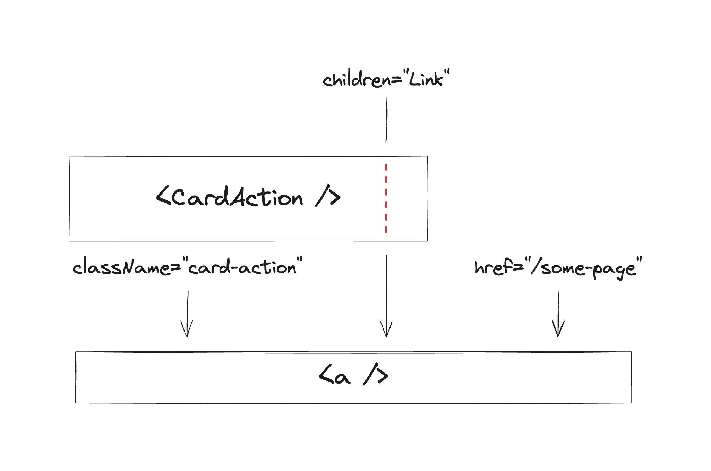

When building complex repeatable pieces of UI, it's tempting to abstract everything into a single "black box" component.

For example, we could create a "Card" component that looks like this:


Since the card has quite a few parts, we'll need a few props to customize it:

```twoslash include card-1-props
import type { ReactNode } from "react";

type CardProps = {
  title: string;
  subtitle: string;
  children?: ReactNode; // The content of the card.
  leftAction: {
    text: string;
    onClick: () => void;
  };
  rightAction: {
    text: string;
    onClick: () => void;
  };
};
```

```tsx twoslash
// @include: card-1-props
```

Our card component might look something like this:

```tsx twoslash
// @include: card-1-props
// ---cut---
function Card({
  title,
  subtitle,
  children,
  leftAction,
  rightAction,
}: CardProps) {
  return (
    <section>
      <header>
        <h1>{title}</h1>
        <p>{subtitle}</p>
      </header>
      <div>{children}</div>
      <footer>
        <button onClick={leftAction.onClick}>{leftAction.text}</button>
        <button onClick={rightAction.onClick}>{rightAction.text}</button>
      </footer>
    </section>
  );
}
```

Excellent! That'll do the trick.

# YAP-ing

Some time passes. We now need a card that doesn't have a subtitle or a left action, like this:


Let's make those props optional:

```twoslash include card-2-props
import type { ReactNode } from "react";

type CardProps = {
  title: string;
  subtitle?: string;
  children?: ReactNode; // The content of the card.
  leftAction?: {
    text: string;
    onClick: () => void;
  };
  rightAction: {
    text: string;
    onClick: () => void;
  };
};
```

```tsx twoslash {5,7-10,28,32-34}
// @include: card-2-props

function Card({
  title,
  subtitle,
  children,
  leftAction,
  rightAction,
}: CardProps) {
  return (
    <section>
      <header>
        <h1>{title}</h1>
        {subtitle && <p>{subtitle}</p>}
      </header>
      <div>{children}</div>
      <footer>
        {leftAction && (
          <button onClick={leftAction.onClick}>{leftAction.text}</button>
        )}
        <button onClick={rightAction.onClick}>{rightAction.text}</button>
      </footer>
    </section>
  );
}
```

Okay, that works. All is good for a while, until we introduce a new feature in our app. Now, we require a card that has a link instead of an action. Let's also add an action in the header for good measure:


_Sigh._ Let's add more props:

```tsx twoslash {15-22}
import type { ReactNode } from "react";

type CardProps = {
  title: string;
  subtitle?: string;
  children?: ReactNode; // The content of the card.
  leftAction?: {
    text: string;
    onClick: () => void;
  };
  rightAction: {
    text: string;
    onClick: () => void;
  };
  headerAction?: {
    text: string;
    onClick: () => void;
  };
  link?: {
    text: string;
    href: string;
  };
};

// You can imagine the implementation...
```

These props and conditionals are quickly adding up. We can easily imagine future variants that require even more props, like `hideFooter`, `image`, `rightAction.tooltip`, `middleAction`, and so on. You might have even seen something like this in your codebase.

This is what [Kyle Shevlin](https://twitter.com/kyleshevlin) calls "YAP-ing" ("Yet Another Prop" Syndrome). I stole the "Card" example above from his article: ["Quit Your YAP-ing"](https://kyleshevlin.com/quit-your-yapping/). Go read it!

# The problem with YAP-ing

YAP-ing presents many potential issues:

- The **complexity** of the component increases with each new prop.

  Arguably, it increases _exponentially_, because each new prop could potentially interact with all the others. It creates a combinatorial problem that quickly becomes unmanageable.

- It can **lock you out** of certain requirements, at least without significant breaking changes.

  Kyle gives a good example: "What happens if [the designers] ask for only a single button, but it should only span half the width of the Card’s footer? Which prop is that now? If we have three different action slots, how do we do half of the width of the card?"

- It adds a lot of **maintenance burden**.

  The more complexity, the more stuff you'll be responsible for maintaining, and the larger the surface area for bugs. By trying to "do it all", you're setting yourself up for _a lot (all?) of work_.

- Many others: potentially **larger bundle size**, **harder to test**, **steeper learning curve**...

I call this type of component (the one that YAPs) **the "everything bagel" component**: a component that tries to do everything and ends up becoming a mess over time.

---

<YoutubeVideo id="aJhKVICLi9s" />

> The video above shows a TV anchor talking to the Dalai Lama. He tries to make a joke:
>
> _"The Dalai Lama walks into a pizza shop and says, 'Can you make me one with everything?'"_
>
> The Dalai Lama doesn't get it. I love this video.

---

Don't get me wrong, there is a time and place for "everything bagel" components! In fact, **I actively recommend them** in some cases, as we'll explore in the "Finding the balance" section below.

# Quitting YAP-ing

In his article, Kyle suggests that the solution to YAP-ing is **composition**. I couldn't agree more!

Here are the four main strategies I recommend to achieve this:

## Slots

Instead of trying to account for every possible variation in a single component, you can add "slots" for different parts of the UI. In the card example, this might involve having "header", "body", and "footer" slots.


In some UI libraries such as Solid or React, Slots can be implemented through simple props. The `children` prop can be considered the "default" slot.

For our example, the "body" slot seems like a good fit for `children`, and we can add props for the header and footer slots.

We can even make them optional, and conditionally render containers for them.

```twoslash include slots
import type { ReactNode } from "react";

type CardProps = {
  headerSlot: ReactNode;
  children: ReactNode;
  footerSlot?: ReactNode; // The footer is optional.
};

function Card({ headerSlot, footerSlot, children }: CardProps) {
  return (
    <section>
      <header>{headerSlot}</header>
      <div>{children}</div>
      {footerSlot && <footer>{footerSlot}</footer>}
    </section>
  );
}
```

```tsx twoslash
// @include: slots
```

> Fun fact: the web platform [supports slots](https://developer.mozilla.org/en-US/docs/Web/API/Web_components/Using_templates_and_slots) natively. Note that the feature is oriented towards [Web Components](https://developer.mozilla.org/en-US/docs/Web/API/Web_components) and, therefore, potentially incompatible with libraries like React or Solid.

With slots, we can now compose our card component in a more flexible way:

```tsx twoslash
// @include: slots
// ---cut---
<Card
  headerSlot={<h1 className="text-2xl font-bold">My card</h1>}
  footerSlot={
    <>
      <button className="hover:bg-gray-200 text-black">ACTION</button>
      <button className="hover:bg-gray-200 text-black text-primary-500">
        ACTION
      </button>
    </>
  }
>
  <p>Body content, lorem ipsum, etc.</p>
</Card>
```


> I plan on writing a more in-depth article on slots in the future, so stay tuned!

{/* TODO: link to slots article */}

## Compound components

Another way to facilitate composition is through **compound components**. This pattern involves breaking down the component into smaller, more specialized components that work together.

While slots allow for a lot of flexibility, they create a new challenge: their content needs to be created from scratch.

Our card might display different styles throughout the app, but we still want a somewhat cohesive look. For example, we want titles, subtitles and buttons to look the same across all cards.

[We don't want to be like Steam!](https://www.reddit.com/r/Steam/comments/tisoop/the_amazing_consistency_of_steams_ui/)


This is where compound components come in handy. We can create a set of components that work together to create a card, each with its own set of built-in styles, like `CardTitle`, `CardSubtitle`, `CardAction`, etc.

```twoslash include compound-components
import clsx from "clsx";

// card title
// ----------

type CardTitleProps = { children?: ReactNode };

function CardTitle({ children }: CardTitleProps) {
  return <h1 className="text-2xl font-bold">{children}</h1>;
}

// card subtitle
// -------------

type CardSubtitleProps = { children?: ReactNode };

function CardSubtitle({ children }: CardSubtitleProps) {
  return <p className="text-gray-500">{children}</p>;
}

// card action
// -----------

type CardActionProps = {
  children?: ReactNode;
  /** @default "secondary" */
  variant?: "primary" | "secondary";
};

function CardAction({ variant = "secondary", children }: CardActionProps) {
  return (
    <button
      className={clsx(
        "hover:bg-gray-200 text-black",
        variant === "primary" && "text-primary-500"
      )}
    >
      {children}
    </button>
  );
}
```

```tsx twoslash
// @include: slots
// ---cut---
// @include: compound-components
```

Putting it all together:

```tsx twoslash
// @include: slots
// @include: compound-components
// ---cut---
<Card
  headerSlot={
    <>
      <CardTitle>My card</CardTitle>
      <CardSubtitle>Here's a nice subtitle!</CardSubtitle>
    </>
  }
  footerSlot={
    <>
      <CardAction>ACTION</CardAction>
      <CardAction variant="primary">ACTION</CardAction>
    </>
  }
>
  <p>Body content, lorem ipsum, etc.</p>
</Card>
```


Alternatively, it might make sense to replace the slots themselves with compound components:

```tsx twoslash
import { ReactNode } from "react";
type CardProps = { children?: ReactNode };
function Card({ children }: CardProps) {
  return <section />;
}
type CardHeaderProps = { children?: ReactNode };
function CardHeader({ children }: CardHeaderProps) {
  return <header>{children}</header>;
}
type CardBodyProps = { children?: ReactNode };
function CardBody({ children }: CardBodyProps) {
  return <div>{children}</div>;
}
type CardFooterProps = { children?: ReactNode };
function CardFooter({ children }: CardFooterProps) {
  return <footer>{children}</footer>;
}
// @include: compound-components
// ---cut---
<Card>
  <CardHeader>
    <CardTitle>My card</CardTitle>
    <CardSubtitle>Here's a nice subtitle!</CardSubtitle>
  </CardHeader>
  <CardBody>
    <p>Body content, lorem ipsum, etc.</p>
  </CardBody>
  <CardFooter>
    <CardAction>ACTION</CardAction>
    <CardAction variant="primary">ACTION</CardAction>
  </CardFooter>
</Card>;
```

There are many things to consider when choosing the exact structure and API of your components. Compound components themselves can be authored in many different ways, including:

- The naming and structure could be flat (`CardHeader`, `CardTitle`, `CardAction`...) or nested (`Card.Header`, `Card.Title`, `Card.Action`).
- The components could be exported as named exports, or as properties of the main component, or all in one object.
- When there is a shared state, it is typically exposed to sub-components through a context, but other techniques can be used. One example in React is children introspection and manipulation (`Children.map`, `React.cloneElement`, etc).

> As with slots, I also plan on writing a more in-depth article on compound components very soon, stay tuned!

{/* TODO: link to compound components article */}

## Polymorphism

> _Noun, [the ability to assume different forms or shapes](https://en.wiktionary.org/wiki/polymorphism)._
>
> - [poly](https://en.wiktionary.org/wiki/poly-) - "many", from Ancient Greek's "polús"
> - [morph](https://en.wiktionary.org/wiki/-morphism#English) - "shape", from Ancient Greek's "morphḗ"
> - [ism](https://en.wiktionary.org/wiki/-ism#English) - just visit the link if you care 😇

The word ["polymorphism"](<https://en.wikipedia.org/wiki/Polymorphism_(computer_science)>) sounds very fancy and complicated but is fairly simple to understand in the context of components.

When we say that a component is "polymorphic", we simply mean that it can be "rendered as" a different element or component than the default. Let's use a practical example:

We have our card with a `<CardAction>` component which renders a `<button>` by default. But what if we want to render an `<a>` instead, to link to another page?


We could start adding props like `isLink`, `linkHref`, `linkTarget`... but we know where that leads (YAP-ing!). Instead, we can make `<CardAction>` polymorphic.

There are multiple ways to achieve this, like the popular `as` prop:

```tsx
<CardAction as="a" href="/some-page">
  Link
</CardAction>
```

However, the `as` prop is difficult to implement correctly and has some serious downsides, especially when it comes to TypeScript. This is the reason why the Radix team replaced it with [the `asChild` prop](https://www.radix-ui.com/primitives/docs/guides/composition), which addresses many of the shortcomings:

```tsx
<CardAction asChild>
  <a href="/some-page">Link</a>
</CardAction>
```

Under the hood, our component is cloning the child `<a>` element (with `React.cloneElement`) and passing it any props it would normally have passed to the default `<button>`. If there are duplicated props, it also merges those that can be merged or overrides them if they can't.

In addition to these strategies, another popular one is to use a render function prop:

```tsx
<CardAction render={(props) => <a {...props} href="/some-page" />}>
  Link
</CardAction>
```

In this instance, the user is responsible for rendering the element, and the component provides the props it would normally pass to the default `<button>`. Any merging or overriding of props is also the user's responsibility.

This approach is more flexible but also more error-prone and presents downsides like getting in the way of memoization in React.

Lastly, my favorite approach is [Ariakit's `render` prop](https://ariakit.org/guide/composition), which is a combination of the `React.cloneElement` strategy and the render function prop:

```tsx
<CardAction render={<a href="/some-page" />}>Link</CardAction>;
// or
<CardAction render={(props) => <a {...props} href="/some-page" />}>
  Link
</CardAction>;
```

The first form is very similar to the `asChild` prop, but instead of passing the element as a child, it is passed directly to the `render` prop, leaving the children for the content of the element. The second form is the standard render function prop, which enables advanced use cases.

Regardless of the implementation and API, the end result is the same: we're making our `CardAction` component replace the default `<button>` with an `<a>` element and passing the necessary props to it.

Initially, this is how props flow to the `<button>` element:


When we take advantage of polymorphism, the props flow to the `<a>` element instead:



---

Beyond use cases like "button as link", polymorphism is also very helpful in achieving proper accessibility.

For example, our example `<Card>` component renders as a `<section>` element by default, but that might not be semantically appropriate in the context of your page. Instead, something like `<li>`, or `<article>`, or even a plain `<div>` might be a better fit.

Another example is our `<CardTitle>` component, which renders as an `<h1>`. This might not be the right heading level, and instead, you might need to render it as an `<h2>` or `<h3>`.

> I will write a detailed article on polymorphism in the future, including how to implement each of these strategies in your own components, so stay tuned!

{/* TODO: link to polymorphism article */}

## Open/closed components

We can get pretty far with slots, compound components, and polymorphism, but there are some remaining challenges before we can quit our YAP-ing for good.

For starters:

- What if we want to add some "outer" styles to our card component? Think margins, flex/grid child properties, sizing, positioning...

- What if we want to add some event listeners to it? We might want to make it draggable, kanban-style, or maybe add a keyboard shortcut to it.

- What if we need to set accessibility attributes on it, like `aria-label`?

Your YAP-brained mind might be itching to add custom props for all of these, like `margin`, `draggable`, `accessibleLabel`... but you need to be strong. There is a better way!

If we take a step back, we might realize that all of these require interacting with the underlying HTML element that our component renders, since all of these are properties of the DOM element itself.

Components are useful abstractions that allow us to bundle a set of styles and features, but at the end of the day, **your website or app still runs on top of the web platform**. This is great, and you should take advantage of it!

Instead of thinking of your components as black boxes, think about them as "extensions" of native HTML elements (or UI primitives from libraries like [Radix](https://www.radix-ui.com/primitives) and [Ariakit](https://ariakit.org/)). Think of the styles and behavior you add to them as "sprinkles" on top.


---

For example, if you're building a button component, you probably want to expose the `onClick` prop and forward it to the underlying `<button>`. Great, you now have a functional button component!

Additionally, you might want to add some default styles with it, with some variants. To achieve this, you can add a `variant` prop that sets a specific CSS class on the `<button>` element, depending on the value.


We should not only pass the `onClick` prop to the `<button>`, but also any other props so that all use cases (like the ones discussed at the top of this section) are covered. This button component might end up looking like this:

```jsx
function Button({ variant, ...props }) {
  return <button className={variant} {...props} />;
}
```

However, this is not enough because if we pass a `className` prop to the `Button`, it will override the internal class set when passing a `variant` prop. To fix this, we can merge the `className` prop with the `variant` prop:

```jsx
function Button({ variant, ...props }) {
  return <button {...props} className={`${variant} ${props.className}`} />;
}
```

Other props can be merged, like `style`, and event handlers. When props can't be merged, they should take priority over the internal ones. For example, we might want to set the `type` prop to `"button"` by default, but allow the user to override it:

```jsx
function Button({ variant, ...props }) {
  return (
    <button
      type="button"
      {...props}
      className={`${variant} ${props.className}`}
    />
  );
}
```

This pattern is called "the open/closed component". The component is "open" for extension, but "closed" for modification. The name was coined by [Diego Haz](https://twitter.com/diegohaz), the author of [Ariakit](https://ariakit.org/).

---

There is another, strong reason for making your components open/closed. Imagine we want to add a tooltip to a `<CardAction>` in our card.


We have a few options to implement this, but I'll reach for [the Ariakit `Tooltip` component](https://ariakit.org/components/tooltip) in this instance.

> Note: [the `title` HTML attribute](https://developer.mozilla.org/en-US/docs/Web/HTML/Global_attributes/title) behaves similarly to a tooltip, but [it has significant accessibility issues](https://inclusive-components.design/tooltips-toggletips/) so I don't recommend using it.

Ariakit's `Tooltip` is used like this:

```tsx twoslash
import * as Ariakit from "@ariakit/react";
// ---cut---
<Ariakit.TooltipProvider>
  <Ariakit.TooltipAnchor render={<button />}>ACTION</Ariakit.TooltipAnchor>
  <Ariakit.Tooltip>Tooltip content</Ariakit.Tooltip>
</Ariakit.TooltipProvider>;
```

The tooltip anchor is whatever you want to attach the tooltip to, while `Tooltip` contains the UI that will show up when the anchor is hovered or focused.

This is more or less what needs to happen, in simplified pseudocode form:

```tsx twoslash
import { useState } from "react";
function doAction() {}
const [showTooltip, setShowTooltip] = useState(false);
// ---cut---
<>
  <button
    onClick={doAction}
    onPointerEnter={() => setShowTooltip(true)}
    onPointerLeave={() => setShowTooltip(false)}
  >
    ACTION
  </button>
  {showTooltip && <div>My tooltip's content</div>}
</>;
```

As you can see, there is no need to add a wrapper element to the anchor element (our `<button>`). We only need the appropriate event handlers to be passed to it.

The `TooltipAnchor` component achieves this through polymorphism: it "renders as" whatever you want the anchor to be. In our case, we need to do something like this:

```tsx twoslash
import { ReactNode } from "react";
// @include: compound-components
import * as Ariakit from "@ariakit/react";
// ---cut---
<Ariakit.TooltipAnchor render={<CardAction variant="primary" />}>
  ACTION
</Ariakit.TooltipAnchor>;
```

However, **this won't work unless our `CardAction` component is open/closed**, because the `onPointerEnter` and `onPointerLeave` event handlers need to be forwarded to the underlying `<button>` element.

There is a lot more to say about open/closed components, so I wrote an extensive article series on the topic. I cover everything: use cases, implementation, the philosophical aspects of it, edge cases, examples of it in popular libraries...

<blockquote>
  <p class="text-center">
    Learn more: [✨ The open/closed component series
    ✨](/article/the-open-closed-component-part-1)
  </p>
</blockquote>

# Finding the balance

All of these techniques are important to master, but it's also important to know when to use them. There is often a tension between the simplicity of a "do it all" approach and the flexibility of a more composable one.

It's also not a black-and-white issue. A component can use a mix of all these strategies, and it can evolve in different directions. The key to finding the right balance is to understand the context and the trade-offs of each approach.

## The conditions

For starters, it's important to think about whether the following conditions apply:

import { createSignal } from "solid-js";

export const [checks, setChecks] = createSignal(new Set());

export function Checkbox(props) {
  return (
    <li>
      <label class="inline-flex gap-2 items-baseline [&>p]:!my-0">
        <input
          type="checkbox"
          onChange={(event) => {
            const checked = event.target.checked;
            setChecks((checks) => {
              const newChecks = new Set(checks);
              if (checked) {
                newChecks.add(props.value);
              } else {
                newChecks.delete(props.value);
              }
              return newChecks;
            });
          }}
        />
        {props.children}
      </label>
    </li>
  );
}

<ul>
  <Checkbox value="complex">
    The UI fragment you're building is **complex**.
  </Checkbox>
  <Checkbox value="widely-used">
    The component is going to be **used in many places**.
  </Checkbox>
  <Checkbox value="changes-likely">
    **Significant changes or variants are likely** to be introduced down the
    road.
  </Checkbox>
  <Checkbox value="advanced-use-cases">
    It **needs to support a variety of advanced use cases** (especially
    unforeseen ones).
  </Checkbox>
</ul>

export function Answer() {
  const answer = () => {
    const BREAK_DOWN =
      "Break it down into smaller parts. Then, you can compose them together into a single component, or shift that responsibility to the user.";
    const OPEN_CLOSED_AND_SEMANTICS =
      "Consider building it in as an open/closed component: with that many uses, it's likely to be necessary at some point (e.g. to add styles to it, or use it as a tooltip anchor, or a trigger for a menu or dialog...) and it will stop the YAP-ing before it starts.||If the rendered element affects semantics (e.g. section, header, h1, aside...), polymorphism might be necessary for proper accessibility in different contexts.";
    const IMPACT_OF_FUTURE_CHANGES =
      'Think about the impact of future changes, and consider whether composition patterns will help.||For example, if the changes are simply style variants, an "everything bagel" component might be fine. In other cases, composition might be necessary to avoid breaking changes.';
    if (checks().size === 1) {
      if (checks().has("complex")) return BREAK_DOWN;
      if (checks().has("widely-used")) return OPEN_CLOSED_AND_SEMANTICS;
      if (checks().has("changes-likely")) return IMPACT_OF_FUTURE_CHANGES;
    }
    if (checks().size === 2) {
      if (checks().has("complex") && checks().has("widely-used"))
        return `${BREAK_DOWN}||${OPEN_CLOSED_AND_SEMANTICS}`;
      if (checks().has("complex") && checks().has("changes-likely"))
        return `${BREAK_DOWN}||${IMPACT_OF_FUTURE_CHANGES}`;
      if (checks().has("widely-used") && checks().has("changes-likely"))
        return `${OPEN_CLOSED_AND_SEMANTICS}||${IMPACT_OF_FUTURE_CHANGES}`;
    }
    if (checks().size > 0)
      return "Build a composable component by using slots, compound components, polymorphism, and open/closed components.";
    return 'Start with an "everything bagel" component, and go from there. Use specific composition patterns if they\'re helpful.';
  };
  return (
    <div>
      {answer()
        .split("||")
        .map((text) => (
          <p class="text-lg">{text}</p>
        ))}
    </div>
  );
}

In other words, think about whether the speed and simplicity of authoring a component that tries to "do it all" outweigh the potential downsides in the long term.

If none of the above apply, then go for it! You have my blessing to build an "everything bagel" component.

However, if one or more of the conditions are met, then you need to consider its design more carefully, and whether to use any or all of the strategies we discussed.

> 💡 About to implement a UI component? Interact with the checkboxes above and I'll help you out. Based on your current answers, my advice is:
>
> <Answer />

## The product ↔ library spectrum

Another way to look at this is to think about the "product code" space, the "library code" space, and anything in between.

### Product code

At one edge of the spectrum, we have code that is very specific to the product you're building (a website or app).

Components at this level tend to be **highly specific** and are unlikely to be reused much. Some span entire pages or sections, while others compose lower-level components to achieve certain product features, like a text editor toolbar or an account menu.

Since re-usability and advanced composition use cases are unlikely, there is no need to over-engineer them. It's often fine to **start them as "everything bagel" components**. Then, if there's a good case for the patterns we discussed, you can always use them.

This approach has the following advantages:

- Build product features is **faster**.
- **Straightforward**, no need to think about advanced composition.
- **Constrained**, which helps with consistency. The API surface is small so there's more control over them.
- Can **evolve easily**: breaking changes are trivial to address since the component is used in a limited number of places.

The trade-offs are:

- Potential for **YAP-ing** a bit too much.
- Since it's not composition-ready, a new use case might require **extra work**, like a refactor or a new feature in the component.
- If it gets too complex, it might become **hard to maintain** and get in the way of debugging.

> Even in product code, it makes sense sometimes to use composition patterns. Some examples:
>
> - Your main app layout component might benefit from having slots for a sidebar, a header, and a footer.
> - A complex component can be broken down into simpler pieces. While it's not as helpful for its users, it might simplify maintenance, and you can still export a single component that composes all the smaller ones.
> - You might need some control over the underlying HTML element of a component, e.g. for accessibility reasons. In that case, polymorphism can be helpful.
> - When building a page's layout, you will normally compose sections together and set certain outer styles (margins, sizing, flex/grid child properties...).
>
>   If the sections are open/closed components, you can pass them CSS classes or inline styles from the outside, and therefore co-locate all these layout-related styles in the same parent component, instead of editing each of them internally.
>
>   _(This is especially helpful when working with utility-first CSS frameworks like Tailwind CSS.)_

### Library code

At the other end of the spectrum, we have code that is meant to be reused across many features and views, possibly even between products.

These components are often very low-level, like buttons, inputs, modals, tooltips, etc. They are meant to be used in many different contexts and are often composed together to build more complex UIs. Because of this, they need to be flexible and composable.

There are two main sub-levels to this:

- **Headless UI primitives**, like the ones provided by [Radix](https://www.radix-ui.com/primitives) or [Ariakit](https://ariakit.org/). They are not styled, which is why they're called "headless". Instead, they focus on functionality and accessibility, which is often hard to get right for patterns such as dialogs, menus or comboboxes.

- **Design system components**, which are normally built on top of headless UI primitives or standard HTML elements. These components add a layer of styles and behavior to them, and are very helpful for building consistent UIs.

Product-level components often use these low-level components to build their features. That's why they need to be **fairly generic**, and account for many different use cases.

Because of this, absolutely everything about a library component **should be composable** by default. Then, some compromises can be made, but always keeping the high cost of breaking away from composition in mind. Each instance can be a world of pain down the road, so it needs to be _really, **really** worth it_ and/or have a trivial way to revert it.

#### Make it compound

Unless it's not divisible, like a simple button, each part should be its own component.

> Exceptions to this rule are normally made for the sake of avoiding too much verbosity for users. For example:
>
> - Some markup is there only for styling purposes, and bundling it with the component is normally fine.
> - Some features are worth bundling together, like a dialog that always has a close button.
>
> To still keep the component composable, you can:
>
> - Add props like `containerProps` or `renderContainer` to allow users to customize internal parts.
> - Add props that undo built-in features, like `hideCloseButton` for the dialog example. Better yet, add a `hasCloseButton` prop that defaults to `true`. The user can then pass `false` to hide the close button.

#### Make it open/closed

Let users access the underlying HTML element or primitive, and keep your component open for extension.

> I don't recommend making exceptions to this rule, as the only reason to do so is often to retain control over the component, which almost always fires back.
> {/* TODO: link constraints article */}
>
> If you do decide to make an exception, keep it as small as possible, and only constrain the props or features you are worried about. Even then, consider strategies like renaming the props (e.g. `unsafeProp`) so that the user is aware of the risks, but can still use them.

#### Make it polymorphic

All components should be polymorphic by default, to be combined with others as required.

> As with open/closed components, the only reason I can think of to make an exception is to retain control over the component, and therefore I don't recommend it. You can also apply the renaming strategy here as a middle ground.

#### Add slots to it

If it makes sense, add slots to allow users to customize its contents. It is almost always a better option than YAP-ing and adding a bunch of props like `hasWhatever` or `rightWhatever`.

> Exceptions can be made for the sake of a simpler API, but they need to be thought through mindfully. Some examples:
>
> - A button's loading state that replaces the content with a spinner could be handled with a `loading` prop.
> - Like in the compound example, some parts like the close button of a dialog can be built-in.
>
> Note how both examples don't necessarily get in the way of what the user wants to do. If you need a custom loading UI, you can simply not use the `loading` prop and build your own. In the second example, as discussed before, you could hide the button with a prop.

### The in-between: composability is unidirectional

Here's one last thought for you:

You can build "everything bagels" from composable components, but not the other way around. This is especially important to keep in mind when we look at the in-between space in the spectrum.

By having great composable components at the library level, we can create great intermediate components as needed, to be used at the other end (the product level). Depending on the specifics, these components might benefit from composition strategies as well.

For example, if we want to add analytics to our buttons, we could create a `<TrackedButton>` that extends (as an open/closed component) a `<Button>` from our design system and adds the necessary tracking code with specific props like `trackId`. Then, the button can be used as needed in the product code.

The opposite process is not possible: if we have `<TrackedButton>` but don't want the tracking feature in some part of our UI, we simply can't! We can either:

- Take the YAP route and add more props like `noTracking` (which, as we've learned, can be a slippery slope).
- Stop and break the component down into smaller parts first, then reconstruct the original component with the pieces.

**Both options can be fine sometimes!**

A bit of YAP-ing is not the end of the world, and starting with a specific case and generalizing it later is a common pattern in software development that can speed development up, avoid over-engineering, and give the developer a better understanding of the problem before coming up with a more general solution.

As with everything, just be mindful of the trade-offs!

Typical examples of these intermediate components are:

- More specialized versions of a component: `UserCard`, `SettingsDialog`, `AccountMenu`...
- Components that extend the styles or features of a base component: `AnimatedButton`, `DraggableCard`, `MultiStepDialog`...
- Compositions of multiple components: `PaymentForm`, `ProductList`, `TextEditor`...

---

In conclusion, everything bagels are tasty, but you should consume them in moderation.

Have any thoughts? Leave a comment below or reach out!

See you in the next one 😄
