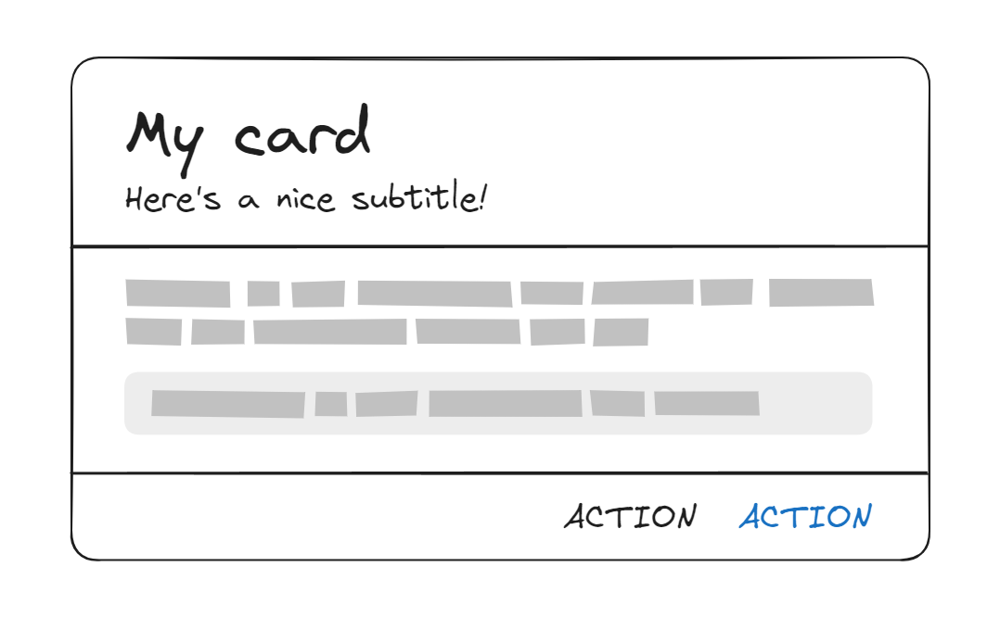

When building complex repeatable pieces of UI, it's tempting to abstract everything into a single "black box" component.

For example, we could create a "Card" component that looks like this:



Since the card has quite a few parts, we'll need a few props to customize it:

```twoslash include card-1-props
import type { ReactNode } from "react";

type CardProps = {
  title: string;
  subtitle: string;
  children?: ReactNode; // The content of the card.
  leftAction: {
    text: string;
    onClick: () => void;
  };
  rightAction: {
    text: string;
    onClick: () => void;
  };
};
```

```tsx twoslash
// @include: card-1-props
```

Our card component might look something like this:

```tsx twoslash
// @include: card-1-props
// ---cut---
function Card({
  title,
  subtitle,
  children,
  leftAction,
  rightAction,
}: CardProps) {
  return (
    <section>
      <header>
        <h1>{title}</h1>
        <p>{subtitle}</p>
      </header>
      <div>{children}</div>
      <footer>
        <button onClick={leftAction.onClick}>{leftAction.text}</button>
        <button onClick={rightAction.onClick}>{rightAction.text}</button>
      </footer>
    </section>
  );
}
```

Excellent! That'll do the trick.

# YAP-ing

Some time passes. We now need a card that doesn't have a subtitle or a left action, like this:


Let's make those props optional:

```twoslash include card-2-props
import type { ReactNode } from "react";

type CardProps = {
  title: string;
  subtitle?: string;
  children?: ReactNode; // The content of the card.
  leftAction?: {
    text: string;
    onClick: () => void;
  };
  rightAction: {
    text: string;
    onClick: () => void;
  };
};
```

```tsx twoslash {5,7-10,28,32-34}
// @include: card-2-props

function Card({
  title,
  subtitle,
  children,
  leftAction,
  rightAction,
}: CardProps) {
  return (
    <section>
      <header>
        <h1>{title}</h1>
        {subtitle && <p>{subtitle}</p>}
      </header>
      <div>{children}</div>
      <footer>
        {leftAction && (
          <button onClick={leftAction.onClick}>{leftAction.text}</button>
        )}
        <button onClick={rightAction.onClick}>{rightAction.text}</button>
      </footer>
    </section>
  );
}
```

Okay, that works. All is good for a while, until we introduce a new feature in our app. Now, we require a card that has a link instead of an action. Let's also add an action in the header for good measure:


_Sigh._ Let's add more props:

```tsx twoslash {15-22}
import type { ReactNode } from "react";

type CardProps = {
  title: string;
  subtitle?: string;
  children?: ReactNode; // The content of the card.
  leftAction?: {
    text: string;
    onClick: () => void;
  };
  rightAction: {
    text: string;
    onClick: () => void;
  };
  headerAction?: {
    text: string;
    onClick: () => void;
  };
  link?: {
    text: string;
    href: string;
  };
};

// You can imagine the implementation...
```

These props and conditionals are quickly adding up. We can easily imagine future variants that require even more props, like `hideFooter`, `image`, `rightAction.tooltip`, `middleAction`, and so on. You might have even seen something like this in your codebase.

This is what [Kyle Shevlin](https://twitter.com/kyleshevlin) calls "YAP-ing" ("Yet Another Prop" Syndrome). I stole the "Card" example above from his article: ["Quit Your YAP-ing"](https://kyleshevlin.com/quit-your-yapping/). Go read it!

# The problem with YAP-ing

YAP-ing presents many potential issues:

- The **complexity** of the component increases with each new prop.

  Arguably, it increases _exponentially_, because each new prop could potentially interact with all the others. It creates a combinatorial problem that quickly becomes unmanageable.

- It can **lock you out** of certain requirements, at least without significant breaking changes.

  Kyle gives a good example: "What happens if [the designers] ask for only a single button, but it should only span half the width of the Card’s footer? Which prop is that now? If we have three different action slots, how do we do half of the width of the card?"

- It adds a lot of **maintenance burden**.

  The more complexity, the more stuff you'll be responsible for maintaining, and the larger the surface area for bugs. By trying to "do it all", you're setting yourself up for _a lot (all?) of work_.

- Many others: potentially **larger bundle size**, **harder to test**, **steeper learning curve**...

I call this type of component (the one that YAPs) **the "everything bagel" component**: a component that tries to do everything and ends up becoming a mess over time.

---

<YoutubeVideo id="aJhKVICLi9s" />

> The video above shows a TV anchor talking to the Dalai Lama. He tries to make a joke:
>
> _"The Dalai Lama walks into a pizza shop and says, 'Can you make me one with everything?'"_
>
> The Dalai Lama doesn't get it. I love this video.

---

Don't get me wrong, there is a time and place for "everything bagel" components! In fact, **I actively recommend them** as long as the following conditions are met:

- The UI fragment you're building is **not overly complex**.
- The component is going to be **used in a very limited number of places**.
- **Significant changes or variants are unlikely** to be introduced over time.

In other words, do this only if the speed and simplicity of writing a "do it all" component outweigh the potential downsides in the long term.

However, if any of the above conditions are not met, then it is a terrible idea.

# Quitting YAP-ing

In his article, Kyle suggests that the solution to YAP-ing is **composition**. I couldn't agree more!

Here are the four main strategies I recommend to achieve this:

## Slots

Instead of trying to account for every possible variation in a single component, you can add "slots" for different parts of the UI. In the card example, this might involve having "header", "body", and "footer" slots.


In some UI libraries such as Solid or React, Slots can be implemented through simple props. The `children` prop can be considered the "default" slot. The "body" slot seems like a good fit for `children`, and we can add props for the header and footer slots.

We can even make them optional, and conditionally render containers for them.

```twoslash include slots
import type { ReactNode } from "react";

type CardProps = {
  header: ReactNode;
  children: ReactNode;
  footer?: ReactNode; // The footer is optional.
};

function Card({ header, footer, children }: CardProps) {
  return (
    <section>
      <header>{header}</header>
      <div>{children}</div>
      {footer && <footer>{footer}</footer>}
    </section>
  );
}
```

```tsx twoslash
// @include: slots
```

> Fun fact: the web platform [supports slots](https://developer.mozilla.org/en-US/docs/Web/API/Web_components/Using_templates_and_slots) natively. Note that the feature is oriented towards [Web Components](https://developer.mozilla.org/en-US/docs/Web/API/Web_components) and, therefore, potentially incompatible with libraries like React or Solid.

With slots, we can now compose our card component in a more flexible way:

```tsx twoslash
// @include: slots
// ---cut---
<Card
  header={<h1 className="text-2xl font-bold">My card</h1>}
  footer={
    <>
      <button className="hover:bg-gray-200 text-black">ACTION</button>
      <button className="hover:bg-gray-200 text-black text-primary-500">
        ACTION
      </button>
    </>
  }
>
  <p>Body content, lorem ipsum, etc.</p>
</Card>
```


I plan on writing a more in-depth article on slots in the future, so stay tuned!

## Compound components

Another way to achieve composition is through **compound components**. This pattern involves breaking down the component into smaller, more specialized components that work together.

While slots allow for a lot of flexibility, they create a new challenge: their content needs to be created from scratch.

Our card might a very different structures in different parts of our app, but we still want a somewhat cohesive look. For example, we want titles, subtitles and buttons to look the same across all cards.

[We don't want to be like Steam!](https://www.reddit.com/r/Steam/comments/tisoop/the_amazing_consistency_of_steams_ui/)


This is where compound components come in. We can create a set of components that work together to create a card, each with its built-in styles, like `CardTitle`, `CardSubtitle`, `CardAction`, etc.

```twoslash include compound-components
import clsx from "clsx";

// card title
// ----------

type CardTitleProps = { children: ReactNode };

function CardTitle({ children }: CardTitleProps) {
  return <h1 className="text-2xl font-bold">{children}</h1>;
}

// card subtitle
// -------------

type CardSubtitleProps = { children: ReactNode };

function CardSubtitle({ children }: CardSubtitleProps) {
  return <p className="text-gray-500">{children}</p>;
}

// card action
// -----------

type CardActionProps = {
  children: ReactNode;
  /** @default "secondary" */
  variant?: "primary" | "secondary";
};

function CardAction({ variant = "secondary", children }: CardActionProps) {
  return (
    <button
      className={clsx(
        "hover:bg-gray-200 text-black",
        variant === "primary" && "text-primary-500"
      )}
    >
      {children}
    </button>
  );
}
```

```tsx twoslash
// @include: slots
// ---cut---
// @include: compound-components
```

Putting it all together:

```tsx twoslash
// @include: slots
// @include: compound-components
// ---cut---
<Card
  header={
    <>
      <CardTitle>My card</CardTitle>
      <CardSubtitle>Here's a nice subtitle!</CardSubtitle>
    </>
  }
  footer={
    <>
      <CardAction>ACTION</CardAction>
      <CardAction variant="primary">ACTION</CardAction>
    </>
  }
>
  <p>Body content, lorem ipsum, etc.</p>
</Card>
```


Alternatively, it might make sense to replace the slots themselves with compound components:

```tsx twoslash
import { ReactNode } from "react";
type CardProps = { children: ReactNode };
function Card({ children }: CardProps) {
  return <section />;
}
type CardHeaderProps = { children: ReactNode };
function CardHeader({ children }: CardHeaderProps) {
  return <header>{children}</header>;
}
type CardBodyProps = { children: ReactNode };
function CardBody({ children }: CardBodyProps) {
  return <div>{children}</div>;
}
type CardFooterProps = { children: ReactNode };
function CardFooter({ children }: CardFooterProps) {
  return <footer>{children}</footer>;
}
// @include: compound-components
// ---cut---
<Card>
  <CardHeader>
    <CardTitle>My card</CardTitle>
    <CardSubtitle>Here's a nice subtitle!</CardSubtitle>
  </CardHeader>
  <CardBody>
    <p>Body content, lorem ipsum, etc.</p>
  </CardBody>
  <CardFooter>
    <CardAction>ACTION</CardAction>
    <CardAction variant="primary">ACTION</CardAction>
  </CardFooter>
</Card>;
```

There are many things to consider when choosing the exact structure and API of your components. Compound components themselves can be authored in many different ways:

- The naming and structure could be flat (`CardHeader`, `CardBody`, `CardFooter`...) or nested (`Card.Header`, `Card.Body`, `Card.Footer`).
- The components could be exported as named exports, or as properties of the main component, or all in one object.
- When there is a shared state, it is typically exposed to sub-components through a context, but other techniques can be used. One example in React is children introspection and manipulation (`Children.map`, `React.cloneElement`, etc).

As with slots, I also plan on writing a more in-depth article on compound components very soon, stay tuned!

## Open/closed components

TODO!

## Polymorphism

TODO!

# Finding the balance

TODO!
