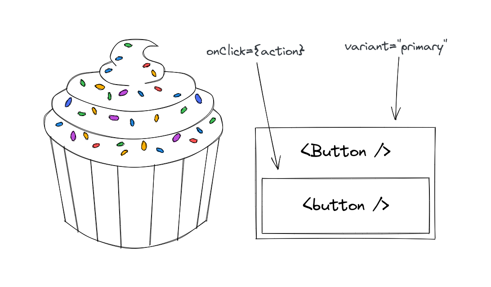
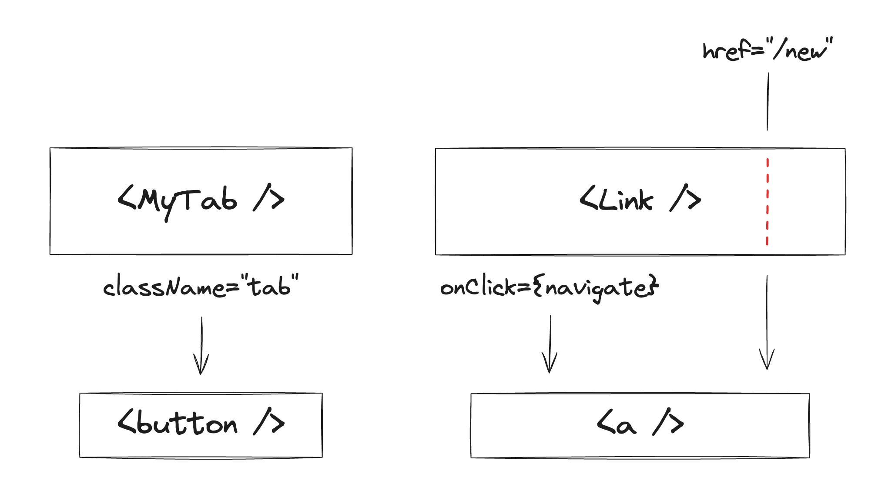
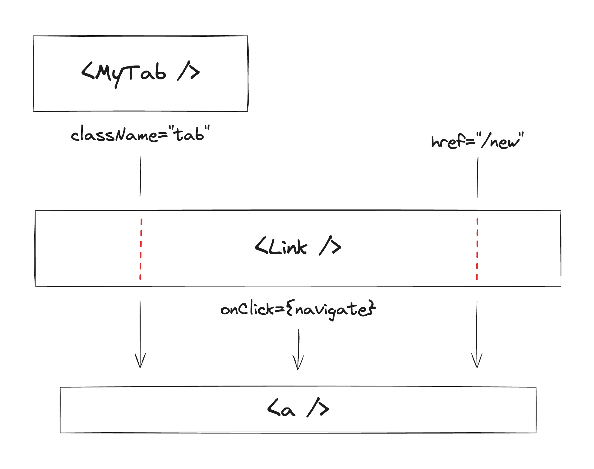
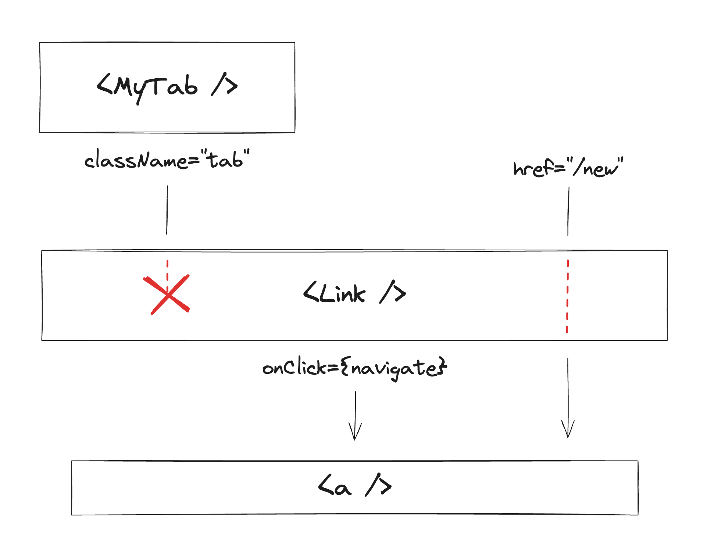

import { TheOpenClosedComponentIndex } from "~/components/ArticleSeriesIndex/TheOpenClosedComponentIndex";

<TheOpenClosedComponentIndex />

There is a pattern that I've come to understand as a **must-have** for many of the UI components I build. I would dare to say it is one of the most powerful ideas I've ever encountered as a frontend developer.

I'm talking about "the **open/closed** component", as coined by [Diego Haz](https://haz.dev/) (author of [Ariakit](https://ariakit.org/)), who introduced this concept in [this Twitter thread](https://twitter.com/diegohaz/status/1305450112890662914).

This pattern has been silently implemented by many for a long time, and thanks to Diego, we now have a name for it. In this series, I'll explain what it is, why it's so powerful, and how to build components that follow this pattern.

# A Game of Props

## The problem

If you've been in the frontend game for long enough, this situation might be familiar. Consider the following React example:

```jsx
function Button({ variant }) {
  return <button className={variant} />;
}

function App() {
  return (
    <>
      <Button variant="primary" />
      <Button variant="secondary" />
    </>
  );
}
```

This looks fine, just one little problem... The buttons are _useless_! There is no way to pass a click event listener!

To fix this, let's add an `onClick` prop to the `Button` component:

```jsx
function Button({ variant, onClick }) {
  return <button className={variant} onClick={onClick} />;
}
```

That does the trick. Further down the line, you'll inevitably need other `<button />` props, such as `disabled`, `type`, `form`, etc.

Instead of slowly adding them one by one over time as they come up, we can be smarter about it. We can collect the "custom" props like `variant` (through destructuring), and then pass the rest straight down to the `<button />` element:

```jsx
function Button({ variant, ...props }) {
  return <button className={variant} {...props} />;
}
```

It's been pretty straightforward so far, but here's where it starts to get a bit trickier. What happens if you now pass a `className` prop to the `Button` component?

```tsx {4}
function Button({ variant, ...props }) {
  return <button className={variant} {...props} />;
}

<Button variant="primary" className="my-class" />;
```

The `"my-class"` value -passed through `{...props}`- will take precedence over `"primary"` -passed through `className={variant}`.

The resolved value that's passed to the `<button />` element will be `"my-class"`, and the `variant="primary"` will have no effect at all!

---

### Prop spreading and precedence

Let's take a quick detour to explain what happens when you pass the same prop (like `className`) multiple times to a component, including as part of prop spreading (e.g. `<div {...props} />`).

If you have a good grasp of this, feel free to skip ahead.

> Passing props to a component results in the same behavior as declaring properties in an object.
>
> That's no coincidence: when the JSX source gets compiled into JavaScript, props are compiled into actual objects! Consider this example:
>
> ```jsx
> <div propA="first" propB={123} propA="second" />
> ```
>
> That JSX component will be typically compiled into something like this:
>
> ```jsx
> jsx("div", {
>   propA: "first",
>   propB: 123,
>   propA: "second",
> });
> ```
>
> In both cases, `propA` will be resolved with a value of `"second"`, since it comes last and overrides any previous props/properties with the same key. If we de-duplicate the keys and leave the final values, we get:
>
> ```jsx
> <div propA="second" propB={123} />;
>
> // compiled:
> jsx("div", {
>   propA: "second",
>   propB: 123,
> });
> ```
>
> When spreading, it's no different. The spread syntax for props and properties is simply syntax sugar for passing multiple key-value pairs at once. Consider the following:
>
> ```jsx
> const props = {
>   propA: "second",
>   propC: "abc",
> };
>
> <div propA="first" propB={123} {...props} propC="xyz" />;
>
> // compiled:
> jsx("div", {
>   propA: "first",
>   propB: 123,
>   ...props,
>   propC: "xyz",
> });
> ```
>
> If we "flatten" the spreads into simple props, we get:
>
> ```tsx
> <div propA="first" propB={123} propA="second" propC="abc" propC="xyz" />;
>
> // compiled:
> jsx("div", {
>   propA: "first",
>   propB: 123,
>   propA: "second",
>   propC: "abc",
>   propC: "xyz",
> });
> ```
>
> Which in turn, de-duplicates to:
>
> ```jsx
> <div propA="second" propB={123} propC="xyz" />;
>
> // compiled:
> jsx("div", {
>   propA: "second",
>   propB: 123,
>   propC: "xyz",
> });
> ```

---

Of course, we don't want `variant="primary"` to be ignored, we need our variant class to be set. We could try inverting the order, like this:

```jsx
function Button({ variant, ...props }: ButtonProps) {
  return <button {...props} className={variant} />;
}
```

However, that doesn't fix anything, it simply switches the problem around. Now, the variant class will take precedence, and the incoming `className` prop will be ignored.

## The solution

Since multiple CSS classes can be applied to an element, we can simply merge all values together:

```jsx
function Button({ variant, ...props }) {
  return <button {...props} className={`${variant} ${props.className}`} />;
}
```

Note how we're still passing `className` twice (once through the spread, and once explicitly). This is fine as long as the merged version is last, as it will take precedence.

We can go further, and merge other props as well, like event handlers:

```jsx
function Button({ variant, ...props }) {
  return (
    <button
      {...props}
      className={`${variant} ${props.className}`}
      onClick={(event) => {
        props.onClick?.(event); // <-- external handler
        console.log("internal handler");
      }}
    />
  );
}
```

> Note that these two examples are simplified and incomplete. I go into a lot more detail on these topics in the next part of the series.

This strategy is great, but we can't merge every prop. The amount of props that can be merged is actually rather small: `className`, `style`, `ref`, and event handlers.

While we can't merge non-mergeable props (duh!), we can let external props override the internal ones. With this approach, the values passed internally can be thought of as "defaults" for the underlying element or component. Defaults that the user can override if they need to.

# What is an open/closed component?

The approach to handling props outlined in the previous example is a part of building an **open/closed** component.

Here's how [Diego](https://haz.dev/) defined it:

> The open/closed (...) component:
>
> A component that is based on the open/closed principle, which states that “software entities (classes, modules, functions, etc.) should be **open for extension**, but **closed for modification**”.

Let's digest this:

- The component is **closed** for modification, meaning that you can't change the component itself. You can't edit its source code to adapt it to your needs!
- The component is **open** for extension, meaning that you can extend it, **without** changing its implementation.

This is a critical thing to understand. As Diego put it:

> A component is closed for modification when you **don't need** to update its source code to extend its functionality.

It's not just that you **can't** update the source code, it's that you **don't need** to.

## Sprinkles on top

Native HTML elements are great examples of the open/closed principle in action. You can't alter their core functionality, but you can enhance them with attributes and event listeners to suit your needs.

This concept also applies when you develop your components. By designing components that don't obscure the underlying elements, you allow users to access both the native capabilities and any custom features you've added.

For example, if you create a custom button, users can interact with both the button's native functionality (e.g. `onClick`) and any additional features you've designed (e.g. `variant`).



By following the open/closed principle, more components can be created on top of existing components, creating a hierarchy of components that build on each other.

> If this sounds familiar, that's because it's just good old [object-oriented programming](https://en.wikipedia.org/wiki/Object-oriented_programming)! The [open/closed principle](https://en.wikipedia.org/wiki/Open%E2%80%93closed_principle) is an OOP concept.

A way I like to think about this is that you're taking a native element or component, and adding a few sprinkles of functionality (or aesthetics) on top of it.

## When inheritance enables composition

In component-oriented UI frameworks like React and Solid.js, a recommended best practice is to [use composition instead of inheritance](https://legacy.reactjs.org/docs/composition-vs-inheritance.html).

Open/closed components seem to contradict this advice: they inherit and extend the behavior and API of a different element or component. Ironically though, building components this way enables **advanced composition patterns**.

Notably, it enables **the "render as" pattern**, which consists of rendering a component as a different element or component. Many UI component libraries support this, though the exact implementation varies.

The ([infamous](https://twitter.com/jjenzz/status/1423766700885954562)) `as` prop is probably the most known, but for the following examples, I'll use [the `render` prop from Ariakit](https://ariakit.org/guide/composition).

```jsx
<MyButton render={<a href="https://dio.la/" />} />
```

The example above will render `MyButton` -including its custom styles and behavior- as an `<a>` HTML element (instead of the default `<button>`) that links to my blog. We can also do this with a component:

```jsx
<MyTab render={<Link href="/new" />}>New</Tab>
```

In this case, `MyTab` will be rendered as a `Link` (here, `Link` could be a framework-specific component that handles routing, [e.g. in Next.js](https://nextjs.org/docs/app/api-reference/components/link)).

It's important to understand what we mean by "rendered as", so let's break it down:

- `MyTab` renders a `<button>` element by default. It passes it a few props, like `className` for styling.
- `Link` renders an `<a>` element under the hood, and passes it a few props as well. For example, to handle client-side routing, it passes an `onClick` handler. It also passes the `href` prop down to `<a>`.



When we make `MyTab` "render as" a `Link`, the props that it would pass to `<button>` (like `className`) are now passed to `Link` instead. In this way, a "chain" of components is created where props flow down until they ultimately reach the underlying HTML element.



Note how `Link` forwards the `className` prop down to `<a>`. If this wasn't the case, then the `MyTab` component would lose its appearance!



This is because `MyTab` has an HTML-element-shaped "hole". By default, that hole is filled with a `<button>`, but it can be filled with anything else that behaves like an HTML element.

How does an HTML element behave then? Among other things, it accepts CSS classes that are reflected in the HTML document tree.

If `className` is ignored by `Link`, then we can't say it behaves like an HTML element. That's why this example breaks!

---

To avoid this kind of problem, Radix has a couple of rules, including ["Your component must spread props"](https://www.radix-ui.com/primitives/docs/guides/composition#your-component-must-spread-props). Similarly, Ariakit indicates that ["Custom components must be open for extension"](https://ariakit.org/guide/composition#custom-components-must-be-open-for-extension), which can be broken down into a few rules including "Spread all props (...)".

In other words, the components **must be open/closed**! These two libraries (as well as many others) have HTML-element-shaped holes everywhere, and all of their components are designed to be open/closed and _fit into those holes_.

This unlocks amazing composition patterns, like the following example [from the Radix docs](https://www.radix-ui.com/primitives/docs/guides/composition#composing-multiple-primitives):

```jsx {2-6}
<Dialog.Root>
  <Tooltip.Root>
    <Tooltip.Trigger asChild>
      <Dialog.Trigger asChild>
        <MyButton>Open dialog</MyButton>
      </Dialog.Trigger>
    </Tooltip.Trigger>
    <Tooltip.Portal>...</Tooltip.Portal>
  </Tooltip.Root>

  <Dialog.Portal>...</Dialog.Portal>
</Dialog.Root>
```

Radix is low-level, so it can be a little verbose. In your own component library, with the right abstractions, composition can become even simpler!

For example, this is [a real example](https://atlas.guide.co/?path=/story/stories-menu--trigger-with-tooltip) from a component library I build in the past:

```jsx {1-5}
<Menu.Root>
  <Tooltip content="More options">
    <Menu.Trigger>
      <Button icon={optionsIcon} />
    </Menu.Trigger>
  </Tooltip>
  <Menu.Content>...</Menu.Content>
</Menu.Root>
```

This is a **button** that acts as a **menu trigger** and a **tooltip trigger**. It renders as a single `<button>` element but has the behavior of all three components.

This is all enabled by open/closed components, along with the "render as" pattern!

---

> _'Enough philosophical stuff!'_ you say. _'How do I actually build an open/closed component?'_

Okay, okay. We'll do it in the next article (in React for now).

Stay tuned!
