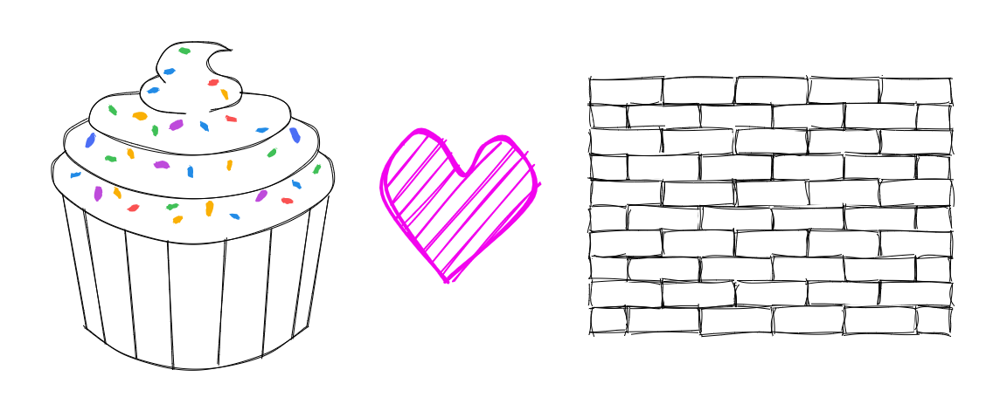

import { TheOpenClosedComponentIndex } from "~/components/ArticleSeriesIndex/TheOpenClosedComponentIndex";

<TheOpenClosedComponentIndex />

In [parts 1](/article/the-open-closed-component-part-1) [and 2](/article/the-open-closed-component-part-1) of this series, we've learned about open/closed components and how to build them.

At this point, if you've worked with design systems before, you might be wondering...

> What about the constraints?!?

I hear you. I am a huge design systems guy, and I've spent some of my past years building them full-time.

One of the things you'll hear time and time again is that _a design system is a set of constraints_ that are in place to make sure that your apps/websites are consistent and predictable.

In other words, **constraining the choices that a team of designers and developers can make is a good thing**, and a feature rather than a bug. I wholeheartedly agree with that!

It can seem like the open/closed pattern is at odds with that because it allows you to extend the component in almost any way you want. But I don't think that's the case.

# Hitting a wall

When I first started building my first production design system ([Atlas](https://atlas.guide.co/)) for an ever-growing app ([Guide](https://guide.co/)), my philosophy was to constrain everything as much as possible. I was operating under the assumption that as you impose more constraints, the development team gets more productive, and the quality of the output gets higher.

Ah, the illusion of control! _I quickly realized that this was not the case._

As the design system and its usage grew, some pains began to arise. Since the components were black boxes, almost any new use case required investing in adding new features or reworking some of the implementation details or API. Moreover, trying to get components and libraries to work together was a nightmare.

Maybe we needed to show a tooltip for a button that was also the trigger for a menu. Or maybe we needed a button that needed to behave like a link. Many things that seemed simple at first quickly became very complex.

> Sometimes, **this resulted in developers not using the design system components**, and creating rough and unpolished one-off alternatives using native HTML elements directly, just so that they'd work with some library or layout.
>
> A fork like that is never good news!

# Exercise constraint

The truth is that I was constraining the wrong thing. For example, it makes sense to constrain the variants of a button (e.g. primary, secondary, etc.), since that's gonna help you keep a consistent look and feel across your app. However, I'd also constrain other aspects without a clear reason to do so.

I was so down with the idea of constraining stuff in the service of consistency that I became a bit of a control freak. By default, everything needed to be constrained.

_✨ A constrained world is a happy world! ✨_

Yeah, right. Look, having rules and guidelines is great, but it's very important to remember that **rules are there to serve you, not the other way around**. This is what I had to tell myself.

> So constrain, my friend, constrain away!
>
> Just **don't constrain for the sake of constraining**. Constrain when it serves the purpose that constraining is supposed to serve.

_(I'm not sorry for this section's title pun, or for the 14 times that the word "constraint" or a variant of it has been used in it.)_

# Escape hatches matter

Another critical aspect of a design system is the ability to escape its constraints when necessary. This is something that the open/closed pattern is really good at.

Some devs seem to think that having ways to "break" the established rules is a bad thing, but I disagree with that. **I don't think a design system has failed its purpose when it allows you to escape its constraints.** That's a glass-half-empty way of looking at it.

> Rather, I believe that **a design system has succeeded when you don't need to escape its constraints often**, but you can do it trivially when you need to.

Then, a good strategy to improve your design system is to track how often and in which ways these escape hatches are used. If they're used a lot, that's probably a good opportunity to improve the design system itself.

# Don't reinvent the wheel

Sometimes, we devs can get too caught up in our day-to-day work that we forget to zoom out and look at the bigger picture.

We have an awesome platform called **the web**, with an ever-growing set of beautifully chaotic features manifested in **HTML, CSS, and JavaScript** forms.

We also have amazing **UI frameworks** like React or Solid, even **meta-frameworks** like Next.js or Solid Start. Along with an endless supply of **libraries** that handle timezones (or math, or animation, or whatever) for you.

And, of course, there are collections of **UI primitives** like [Ariakit](https://ariakit.org/) or [Radix UI](https://radix-ui.com/) that augment HTML elements with accessibility features and more (we'll talk about them in the next article).

> Everything is already invented and ready to use. **You don't need to reinvent the wheel!**
>
> Rather, **extend existing elements or components by adding sprinkles of functionality or style on top**. Let web developers use the web.

---

**Note:** the same applies to other platforms like React Native.

**Note 2:** of course, even when the open/closed pattern is not in place, you might still be using these tools under the hood. It's not about whether you use them or not, it's about the API your components expose to the outside world.

See the "Open/closed vs. wrapping" section of [the first article in this series](/article/the-open-closed-component-part-1#openclosed-vs-wrapping) for more on this.

# Win-win

In conclusion, the open/closed pattern and a design system's constraints are not incompatible. In fact, they can work together wonderfully!

You just need to let go of the idea that you need to constrain everything. **Constrain what matters, and let the rest be open.**

If you're like me, this might be hard to accept. Just give it five minutes.

Trust me, you'll be better off. Your design system will be better off. Your team will be better off. Your users will be better off.

> **Let your design system do what it does best, and let other tools do what they do best.** Extend, don't reinvent.

_It's a win-win!_

---

In the next article in the series, we'll explore where the open/closed pattern shines the most (and where it doesn't), as well as examples of libraries that implement it (like Ariakit and Radix UI).

Stay tuned!
